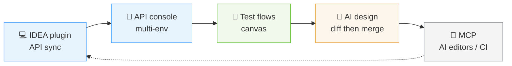
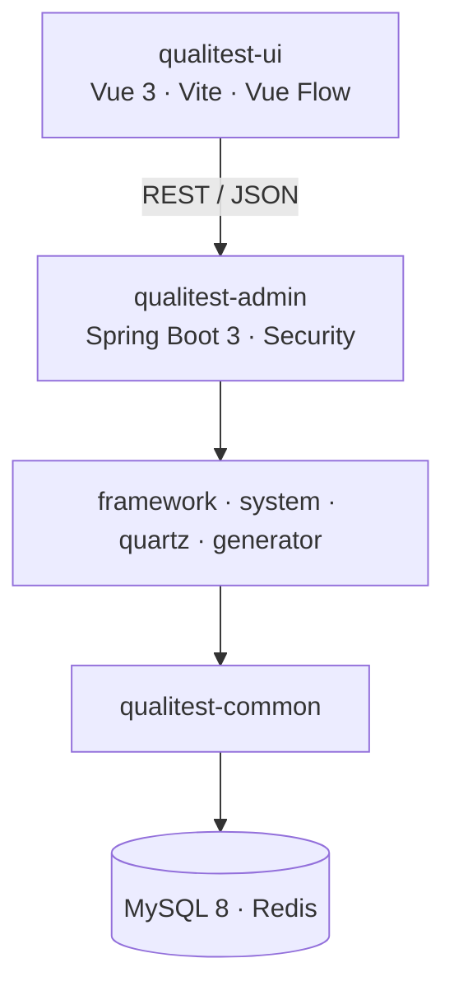
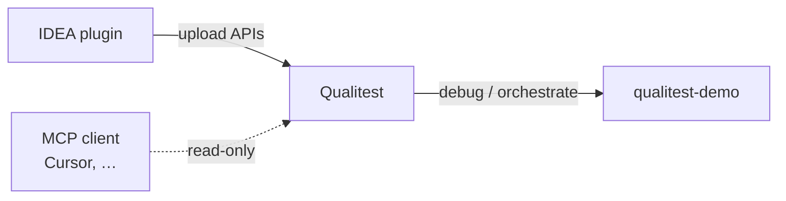

<div align="center">

# Qualitest

**Enterprise API testing & quality platform**

Sync APIs, debug in-project, orchestrate flows, and design with AI — in one place, with fewer tool switches.

<br/>

[](https://openjdk.org/)
[](https://spring.io/projects/spring-boot)
[](https://vuejs.org/)
[](https://www.mysql.com/)
[](https://redis.io/)
[](LICENSE)

<br/>

[Website](https://qualitest-hq.github.io/qualitest/) (source [`site/`](./site/); enable on public day — Settings → Pages → GitHub Actions; see [site/README](./site/README.md)) ·
[中文 README](./README.md) ·
[Highlights](#highlights) ·
[Capabilities](#capabilities) ·
[Demos](#demos) ·
[Architecture](#architecture) ·
[Modules](#modules) ·
[5-minute Quick Start](#5-minute-quick-start) ·
[Deploy](./docs/deploy.en.md) ·
[MCP](./docs/mcp.en.md) ·
[Concepts](./docs/project-summary.en.md) ·
[Flow nodes](./docs/test-flow-nodes.en.md) ·
[AI prompts](https://github.com/qualitest-hq/qualitest-demo/blob/main/docs/ai-test-flow-prompts.md)

<br/>


</div>

---

## Highlights

> **One line:** APIs you write in IntelliJ can be debugged, orchestrated, and AI-assisted on the platform — with team and IDE tooling that actually connects.



Qualitest connects **where APIs come from → how you call them → how you chain them → who helps you design**. You focus on what to test; the platform cuts the busywork.

---

## Capabilities

<table>
<tr>
<td width="50%" valign="top">

### For API authors

**No second copy-paste**

Install the Qualitest IntelliJ plugin and sync Controller definitions to the platform in one click.

Teams share one API inventory — no private Postman collections, no “what’s the real path?” chats.

</td>
<td width="50%" valign="top">

### For API testers

**Debug console lives in the project**

- Select an API and send requests; switch **test / staging / prod** environments in one click
- Params, body, and response are clear; browser-direct or server proxy (**CORS-safe**)
- Single-call checks stay here; assertions, variables, and multi-step chains belong to **test flows**

</td>
</tr>
<tr>
<td width="50%" valign="top">

### For case designers

**Drag-and-drop beats long scripts**

Build steps on a canvas: order, branches, multi-API chains — a reusable flow you can re-run.

Nodes include **HTTP** (project API or external URL), assert, condition, script, **subflow** (fold login / OAuth into one reusable block), and more. Built-in **subflow templates** (login / OAuth / captcha, …) can be forked and parameterized. Project-specific signing or field assembly can use a **Script** node (controlled `ctx.http`).

For mutating flows, enable **snapshot before run** on a node; on failure the run can pause and you may **restore SUT data and retry** (SUT exposes `/test-support`; disabled by default in production). **When restore is on, run the same environment serially** so parallel runs don’t overwrite each other’s data.

</td>
<td width="50%" valign="top">

### For people who want speed

**AI suggests; you decide**

Open the AI panel beside a flow and describe intent in natural language — e.g. “retry after login failure”. Suggestions use **this project’s real APIs** and the current graph.

**Preview the Diff, then merge** — nothing silently rewrites your canvas. Admins can wire multiple LLM vendors for the team.

Paste-ready business intents (with the demo target): [qualitest-demo · AI test-flow prompts](https://github.com/qualitest-hq/qualitest-demo/blob/main/docs/ai-test-flow-prompts.md).

</td>
</tr>
<tr>
<td width="50%" valign="top">

### For AI-assisted coding

**Your IDE can read the test project**

Qualitest exposes a standard **MCP** (Model Context Protocol) **read-only** service. Any MCP-capable editor / agent (Cursor, VS Code ecosystem, Claude Code, …) can connect. Generate a Project Token in project settings and paste the client config (Cursor uses `mcp.json`).

Tools cover APIs, flow list/inspect, failed Run context, subflow templates, topology summaries, and more. **Canvas edits go through the Web AI panel** (diff then merge); MCP never writes the DB.

Typical path: `list_flows` → pick a `testFlowId` → ask “what nodes are on this flow?” / “where did the last run fail?” — answers come from **live platform data**.

→ Templates & sample prompts: [`docs/mcp.en.md`](./docs/mcp.en.md).

</td>
<td width="50%" valign="top">

### For team leads

**Collaboration and access are project-scoped**

- Invite members and assign roles per project
- Issue separate **Project Tokens** for the plugin and CI — no shared personal passwords

</td>
</tr>
</table>

Node reference: [`docs/test-flow-nodes.en.md`](./docs/test-flow-nodes.en.md). Concepts / auth: [`docs/project-summary.en.md`](./docs/project-summary.en.md).

---

## Demos

> One GIF per core action. Prefer width ≤ 900px, 8–10 fps, ≤ 8s, under `docs/images/`.
> Use **[qualitest-demo](https://github.com/qualitest-hq/qualitest-demo)** (port 8081) as the sample SUT for console / flow / AI / MCP demos.
> Compress large GIFs with `gifsicle -O3 --colors 128 in.gif -o out.gif`. For >15s stories, use `.mp4`.

### API console · select, switch env, send


### Test-flow canvas · drag nodes and run


### AI design · Diff then merge


### MCP · IDE reads the test project


### Ecosystem (separate repo)

Demos for [qualitest-intellij-plugin](https://github.com/qualitest-hq/qualitest-intellij-plugin); sample project: [qualitest-demo](https://github.com/qualitest-hq/qualitest-demo).


> Until GIFs are recorded, images may show as broken placeholders; drop files into `docs/images/` with the names above when ready.

---

## Architecture

SPA front end talks to Spring Boot over **REST / JSON**. Business logic lives in `qualitest-system` (APIs, flows, AI, MCP); framework glue in `qualitest-framework`.



| Area | Stack |
|:-----|:------|
| **Front end** | Vue 3.5, Vite, Element Plus, Vue Flow, Axios |
| **Back end** | Java 17, Spring Boot 3.5, Spring Security, MyBatis, PageHelper, Druid |
| **Flows** | GraalVM Polyglot (script nodes), Vue Flow canvas |
| **Extras** | Quartz, SpringDoc, Velocity codegen |
| **Storage** | MySQL 8.x, Redis 3+ |
| **Build** | Maven (backend), Yarn (frontend) |

---

## Modules

| Module | Role |
|:-------|:-----|
| `qualitest-admin` | App entry; deployable JAR |
| `qualitest-ui` | Yarn workspace (Web / Electron) under `qualitest-ui/` |
| `qualitest-framework` | Security, config, shared aspects |
| `qualitest-system` | APIs, flows, AI, MCP, … |
| `qualitest-common` | Shared utilities |
| `qualitest-quartz` | Scheduled jobs |
| `qualitest-generator` | Code generator (Velocity) |

---

## 5-minute Quick Start

> Under `qualitest-all`, clone **three repos** side by side: this repo (includes `qualitest-ui/`), [demo](https://github.com/qualitest-hq/qualitest-demo), [IDEA plugin](https://github.com/qualitest-hq/qualitest-intellij-plugin).  
> Ports, env vars, local dev, production hardening: **[`docs/deploy.en.md`](./docs/deploy.en.md)** (never use default passwords on the public internet).



### ① Start Qualitest

Requires Docker + Compose V2. First `--build` is slow.

```bash
cd qualitest
# Windows: scripts\quick-start.bat
chmod +x scripts/quick-start.sh && ./scripts/quick-start.sh
```

Open **http://localhost**, sign in **`admin` / `admin123`**. Local hot reload: [`scripts/dev-deps-up`](./scripts/dev-deps-up.sh) + `mvn` / `yarn` (see [deploy.en.md](./docs/deploy.en.md#dependencies-only-local-development--hot-reload)).

### ② Start the demo target (optional)

Skip if you already have an SUT. The demo is for zero-config scenarios and AI prompts.  
**Separate Compose stacks** (this repo does **not** `--profile demo`). See [demo deploy](https://github.com/qualitest-hq/qualitest-demo/blob/main/docs/deploy.md); dual-stack notes: [deploy.en.md · Demo target](./docs/deploy.en.md#optional-demo-target--two-compose-stacks).

```bash
cd qualitest-demo
scripts\quick-start.bat
# chmod +x scripts/quick-start.sh && ./scripts/quick-start.sh
```

Swagger is usually **http://localhost:8081/swagger-ui.html**.

### ③ Create a project and sync APIs

1. Sign in → **Test projects** → create → **Project settings** → copy **Project Token**.
2. Install [Qualitest Helper](https://github.com/qualitest-hq/qualitest-intellij-plugin): Compose server URL `http://localhost/prod-api`; local backend `http://localhost:8080`; paste Token.
3. Open `qualitest-demo` (or your app) → **Tools → Qualitest Helper → Project-level upload**.
4. Web **API management** should list endpoints; set environment `baseUrl` to the SUT (demo local: `http://localhost:8081`; Compose app → host demo: see [deploy.en.md](./docs/deploy.en.md#optional-demo-target--two-compose-stacks)).

### ④ Try a main path (pick any)

| Goal | How |
|:-----|:----|
| **Call an API** | API console → pick env → send |
| **Orchestrate** | Test flow → drag HTTP / assert → run |
| **AI assist** | AI panel → describe → **Diff then merge** |
| **MCP** | Copy MCP config from project settings → [`docs/mcp.en.md`](./docs/mcp.en.md) |
| **AI + demo** | [AI test-flow prompts](https://github.com/qualitest-hq/qualitest-demo/blob/main/docs/ai-test-flow-prompts.md) |

More: [Deploy](./docs/deploy.en.md) · [Concepts](./docs/project-summary.en.md) · [FAQ](./docs/faq.en.md) · [Flow nodes](./docs/test-flow-nodes.en.md) · [UI / desktop](./qualitest-ui/README.md) · [Contributing](./CONTRIBUTING.md) · [Security](./SECURITY.md)

---

<div align="center">

**Qualitest** · [Apache-2.0](LICENSE) · [Contributing](CONTRIBUTING.md) · [Security](SECURITY.md)

<sub>Deployment details: [`docs/deploy.en.md`](./docs/deploy.en.md) · Chinese docs: [`README.md`](./README.md)</sub>

</div>
