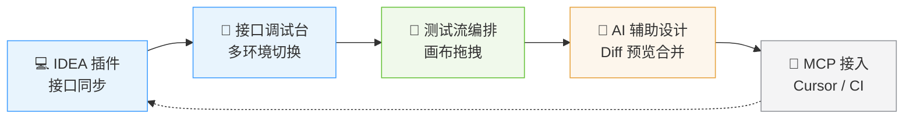
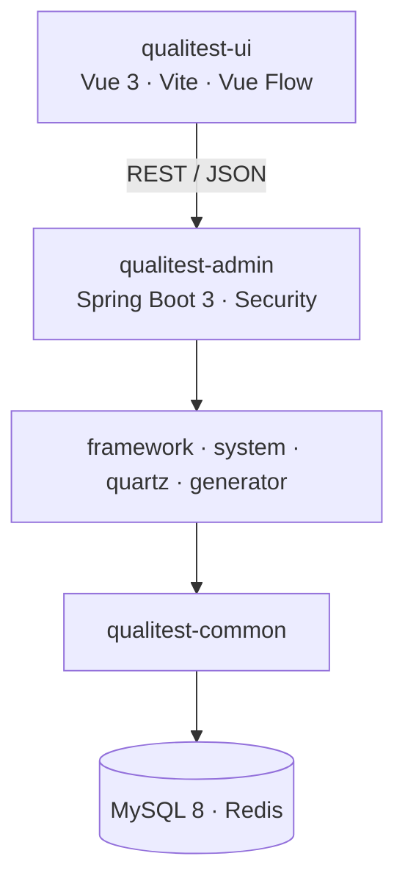
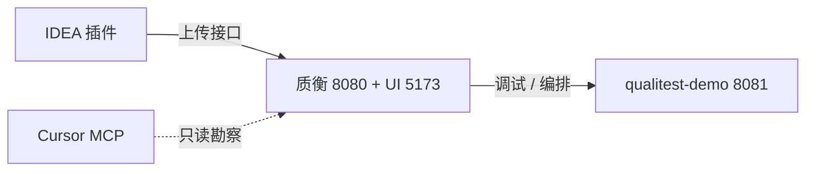

<div align="center">

# 质衡 · Qualitest

**企业级自动化测试与质量保障平台**

让接口同步、调试、编排与 AI 辅助设计在同一项目里闭环 —— 少切换工具，少重复录入。

<br/>

[](https://openjdk.org/)
[](https://spring.io/projects/spring-boot)
[](https://vuejs.org/)
[](https://www.mysql.com/)
[](https://redis.io/)
[](LICENSE)

<br/>

[项目亮点](#-项目亮点) ·
[核心能力](#-核心能力) ·
[功能演示](#-功能演示) ·
[技术架构](#-技术架构) ·
[模块结构](#-模块结构) ·
[5 分钟快速开始](#-5-分钟快速开始) ·
[详细部署](#-详细部署)

<br/>

<!--
  顶部概览 GIF（建议录制规格）：
  - 内容：以 qualitest-demo 为例的一条主链路——IDEA 同步接口 → 调试台发请求 → 画布编排 → AI Diff 合并
  - 宽度 ≤ 900px、帧率 8~10fps、时长 ≤ 10s、体积尽量 < 1MB
  - 录制工具：ScreenToGif / LICEcap；超大用 gifsicle -O3 --colors 128 压缩
  - 文件占位：docs/images/overview.gif（暂未提供时此图显示为占位说明）
-->


</div>

---

## ✨ 项目亮点

> **一句话：** 在 IDEA 里写的接口，到平台上就能调、能编排、能让 AI 帮你补用例 —— 团队和 IDE 工具都接得上。



质衡把 **「接口从哪来 → 怎么调 → 怎么串 → 谁帮你设计」** 连成一条链路。你专注测什么，平台负责少折腾。

---

## 🚀 核心能力

<table>
<tr>
<td width="50%" valign="top">

### 💻 写接口的人

**不用手抄第二遍**

在 IntelliJ IDEA 安装质衡插件，工程里的接口定义一键同步到平台。

从此团队共享同一份接口清单，不用各自维护 Postman 集合，也不用问「这个接口路径到底是多少」。

</td>
<td width="50%" valign="top">

### 🧪 测接口的人

**调试台就长在项目里**

- 选中接口即可发请求，**一键切换测试 / 预发 / 生产** 等环境
- 参数、请求体、响应一目了然，支持浏览器直连或服务端代理（**自动绕过 CORS**）
- 单接口验证在这里完成；断言、变量传递、多步串联交给「测试流」

</td>
</tr>
<tr>
<td width="50%" valign="top">

### 🎨 编排用例的人

**画布拖拽，比写脚本直观**

用流程图画出测试步骤：先后依赖、分支判断、多接口串联，拖一拖就能搭出一套可反复执行的测试流。

支持 **HTTP（项目接口 / 外联 URL）**、断言、条件分支、脚本、**子流**（把登录、OAuth 等多步收成一块复用）等节点；平台内置登录 / OAuth / 验证码等 **子流模板**，fork 后改参数即可。项目特有签名、字段拼装可用 **Script** 节点（含受控 `ctx.http`）兜底。

写操作流可在节点勾选 **执行前快照**，失败后暂停并可 **还原被测数据再重试**（被测方提供 `/test-support` 端点；生产环境默认禁止开启）。**开启数据还原时，同一环境请串行跑**，避免并行 Run 互相覆盖被测库。

改流程不用翻长篇脚本，画布上哪里断了、哪里要加断言，一眼看清。

</td>
<td width="50%" valign="top">

### ⚡ 想省时间的人

**AI 当助手，你来拍板**

在测试流旁打开 AI 助手面板，用自然语言描述「我想测登录失败再重试」—— AI 会结合 **本项目真实接口** 和当前流程给出修改建议。

**先预览 Diff，确认后再合并**，不会悄悄把你的流程改乱。管理员可在后台接入多家大模型，团队按需选用。

</td>
</tr>
<tr>
<td width="50%" valign="top">

### 🔗 用 Cursor 写代码的人

**IDE 也能读懂你的测试项目**

项目设置里生成 Token，复制 MCP 配置到 Cursor 的 `mcp.json`。

MCP 提供 **只读** 工具：查接口、列举/勘察测试流、读 Run 失败现场、看子流模板与拓扑摘要等。**改画布须在 Web 端 AI 面板** 预览 Diff 后合并，MCP 不会直接写库。

典型用法：`list_flows` 选定测试流 → 带 `testFlowId` 问「这条流有哪些节点？」「上次跑挂在哪？」—— AI 读到的是平台上的 **真数据**，不是瞎猜。

</td>
<td width="50%" valign="top">

### 👥 带团队的人

**协作与接入都按项目隔离**

- 按项目邀请成员、分配角色，大家在同一项目里协作
- 为插件、CI 流水线单独签发 **项目 Token**，工具接入不共用个人密码，权限边界清晰

</td>
</tr>
</table>

---

## 🎬 功能演示

> 每个 GIF 只演示一个核心动作，建议宽度 ≤ 900px、帧率 8~10fps、时长 ≤ 8s，统一放在 `docs/images/`。
> 录制时建议以 **[qualitest-demo](https://github.com/qualitest-hq/qualitest-demo)** 为示例工程（端口 8081），主平台调试台 / 测试流 / AI / MCP 等演示均可在该靶场项目上完成，无需单独为靶场录 GIF。
> 体积偏大时用 `gifsicle -O3 --colors 128 in.gif -o out.gif` 压缩；完整流程超过 15s 的，改录 `.mp4` 拖进 README 编辑框。

### 🧪 接口调试台 · 选中即调、一键切环境

<!--
  录制规格：在 qualitest-demo 对应主平台项目中选中一个接口 → 切换 测试/预发 环境 → 发请求 → 展开响应
  宽度 ≤ 900px · 8~10fps · ≤ 8s · 目标 < 600KB
  文件占位：docs/images/demo-api-console.gif
-->


### 🎨 测试流编排 · 画布拖拽搭建用例

<!--
  录制规格：基于 qualitest-demo 项目接口，从节点面板拖出 HTTP / 断言节点 → 连线 → 运行测试流看结果
  宽度 ≤ 900px · 8~10fps · ≤ 8s · 目标 < 800KB
  文件占位：docs/images/demo-flow-canvas.gif
-->


### ⚡ AI 辅助设计 · 自然语言描述、先看 Diff 再合并

<!--
  录制规格：在 qualitest-demo 项目测试流旁打开 AI 面板 → 输入「测登录失败再重试」→ 展示 Diff 预览 → 点击合并
  宽度 ≤ 900px · 8~10fps · ≤ 8s · 目标 < 800KB
  文件占位：docs/images/demo-ai-diff.gif
-->


### 🔗 MCP 接入 Cursor · IDE 直接读懂测试项目

<!--
  录制规格：在 Cursor 中接入 MCP，选定 qualitest-demo 项目测试流 → list_flows → 带 testFlowId 提问「这条流有哪些节点？/ 上次跑挂在哪？」→ 返回平台真数据
  宽度 ≤ 900px · 8~10fps · ≤ 10s · 目标 < 1MB
  文件占位：docs/images/demo-mcp-cursor.gif
-->


---

### 🧩 周边生态演示

> 以下为独立仓库 [qualitest-intellij-plugin](https://github.com/qualitest-hq/qualitest-intellij-plugin) 的演示；插件同步的示例工程建议使用 [qualitest-demo](https://github.com/qualitest-hq/qualitest-demo)。

#### 💻 IDEA 插件 · 项目级上传（qualitest-intellij-plugin）

<!--
  录制规格：在 IDEA 打开 qualitest-demo 工程 → 质衡插件选择「项目级上传」→ 平台项目接口列表批量出现
  宽度 ≤ 900px · 8~10fps · ≤ 8s · 目标 < 600KB
  文件占位：docs/images/demo-idea-sync-project.gif
-->


#### 💻 IDEA 插件 · Controller 全部上传（qualitest-intellij-plugin）

<!--
  录制规格：在 qualitest-demo 中选中一个 Controller → 插件「全部上传」→ 该 Controller 下所有接口出现在平台
  宽度 ≤ 900px · 8~10fps · ≤ 8s · 目标 < 600KB
  文件占位：docs/images/demo-idea-sync-controller-all.gif
-->


#### 💻 IDEA 插件 · Controller 选择上传（qualitest-intellij-plugin）

<!--
  录制规格：在 qualitest-demo 中选中一个 Controller → 插件「选择上传」→ 勾选部分接口 → 仅选中项同步到平台
  宽度 ≤ 900px · 8~10fps · ≤ 8s · 目标 < 600KB
  文件占位：docs/images/demo-idea-sync-controller-pick.gif
-->


> 📌 GIF 暂未录制时，上方图片会显示为「图裂占位」，不影响其他内容渲染；录制完成后将文件按上述命名放入 `docs/images/` 即可自动生效。

---

## 🏗 技术架构

前后端分离，通过 **REST / JSON** 通信；业务集中在 `qualitest-system`（接口、测试流、AI、MCP 等），框架能力封装在 `qualitest-framework`。



| 分类 | 技术选型 |
|:-----|:---------|
| **前端** | Vue 3.5、Vite、Element Plus、Vue Flow、Axios |
| **后端** | Java 17、Spring Boot 3.5、Spring Security、MyBatis、PageHelper、Druid |
| **测试流** | GraalVM Polyglot（script 节点）、Vue Flow 画布编排 |
| **周边** | Quartz 定时任务、SpringDoc API 文档、Velocity 代码生成 |
| **存储** | MySQL 8.x、Redis 3+ |
| **构建** | Maven（后端）、Yarn（前端） |

---

## 📦 模块结构

| 模块 | 说明 |
|:-----|:-----|
| `qualitest-admin` | 后台管理系统入口，打包为可部署 JAR |
| `qualitest-ui` | 前端 Yarn workspace（本仓目录 `qualitest-ui/`，含 Web / Electron） |
| `qualitest-framework` | 框架核心封装（安全、配置、通用切面等） |
| `qualitest-system` | 系统与业务模块（接口、测试流、AI、MCP 等） |
| `qualitest-common` | 通用工具与公共组件 |
| `qualitest-quartz` | 定时任务模块 |
| `qualitest-generator` | 代码生成器（Velocity 模板） |

---

## ⚡ 5 分钟快速开始

> 工作区建议在 `qualitest-all` 下并列 clone **三仓**：本仓库（含前端）、靶场、IDEA 插件。下面按「先跑起来 → 再联调一条链」排列。

### 相关仓库

| 仓库 | 端口 | 一句话 |
|:-----|:-----|:-------|
| 本仓库 [`qualitest`](https://github.com/qualitest-hq/qualitest)（含 [`qualitest-ui/`](./qualitest-ui/)） | **8080** / **5173** | 质衡主平台 + Web |
| [`qualitest-demo`](https://github.com/qualitest-hq/qualitest-demo) | **8081** | 商城靶场，供调试 / 编排 / AI 用例练习 |
| [`qualitest-intellij-plugin`](https://github.com/qualitest-hq/qualitest-intellij-plugin) | — | IDEA 里扫 Controller，一键上传到平台 |



### 前置条件（一次性）

JDK 17+、MySQL 8+、Redis 3+、Maven 3+、Node 18+、Yarn 1.x。数据库账号改各自 `application-dev.yml` 或复制根目录 [`.env.example`](./.env.example) 为 `.env` 后通过环境变量覆盖即可。

> **安全提示（生产必读）**：仓库内 `dev` 默认口令（如库密码 `123456`、弱 `TOKEN_SECRET`）仅便于本地体验。**生产 / 公网部署必须**通过环境变量注入强随机 `TOKEN_SECRET`、数据库与 Redis 口令，并使用 `prod` 或 `docker` profile（`docker` 已关闭 Druid 控制台，上传目录默认 `/data/upload`）。切勿把真实云 API Key、个人 `.env`、`application-local.yml` 提交进 Git。

### ① 启动质衡

#### 方式 A · Docker Compose 全栈（推荐，约首次构建较慢）

前置：Docker Desktop / Compose V2。详情见 [`docs/deploy.md`](./docs/deploy.md)。

```bash
cd qualitest
# Windows
scripts\quick-start.bat
# Linux / macOS
chmod +x scripts/quick-start.sh && ./scripts/quick-start.sh
```

浏览器打开 **http://localhost**，默认账号 **`admin` / `admin123`**。  
仅起数据库依赖：`docker compose up -d mysql redis`。  
靶场 / RustFS：见独立仓 [qualitest-demo](https://github.com/qualitest-hq/qualitest-demo)（`scripts\quick-start.bat`，可选 `rustfs`）。

#### 方式 B · 本机开发（JDK + MySQL + Redis + Yarn）

```bash
# 后端：建库 qualitest，导入 sql/qualitest_*.sql，改 application-dev.yml 后打包启动
cd qualitest
mvn clean package -DskipTests
qualitest.bat          # Windows；Linux 用 ./qualitest.sh

# 前端：另开终端（本仓子目录）
cd qualitest-ui
yarn install && yarn dev
```

浏览器打开 **http://localhost:5173**。  
→ 更多选项见下方 [详细部署](#-详细部署) 与 [`qualitest-ui/README.md`](./qualitest-ui/README.md)。

### ② 启动靶场（约 1 分钟，**可选**）

> **可选说明：** 若你已有自己的 Spring 项目，可跳过本步，直接用 IDEA 插件把**自己的接口**上传到质衡，环境 `baseUrl` 指向你的服务即可。  
> 启动 `qualitest-demo` 只是为了**零配置体验**：自带商城业务、测试场景（S01–S08）和 AI 提示词示例，与本 README 中的演示 GIF / 文档路径一致。

```bash
cd qualitest-demo
# 建库 qualitest-demo，导入 sql/qualitest-demo_*.sql，改 application-dev.yml
mvn clean install && demo.bat    # 或 ./demo.sh
```

Swagger：**http://localhost:8081/swagger-ui.html**  
→ 场景加载、认证说明见 [qualitest-demo README](https://github.com/qualitest-hq/qualitest-demo#readme)。

### ③ 平台里建项目并同步接口（约 2 分钟）

1. 登录质衡 → **测试项目** → 新建项目（例如「Demo 商城」）。
2. 进入 **项目设置** → 复制 **Project Token**。
3. IDEA 安装 [Qualitest Helper](https://github.com/qualitest-hq/qualitest-intellij-plugin)（`buildPlugin` 打 ZIP 离线安装），配置：
   - 服务器地址：`http://localhost:8080`
   - 项目令牌：上一步复制的 Token
4. 用 IDEA 打开 **`qualitest-demo`**（或你自己的 Java 工程）→ **Tools → Qualitest Helper → 项目级上传**（或 Controller 右键上传）。
5. 回到 Web：**接口管理** 应出现已上传接口；**环境** 里把 `baseUrl` 设为被测服务地址（用靶场时为 `http://localhost:8081`）。

→ 插件配置与上传方式见 [插件 README](https://github.com/qualitest-hq/qualitest-intellij-plugin#readme)。

### ④ 跑通一条主链路（任选其一）

| 你想试什么 | 怎么做 |
|:-----------|:-------|
| **调接口** | 接口调试台 → 选中接口 → 切环境 → 发请求 |
| **编排用例** | 测试流 → 拖 HTTP / 断言节点 → 运行 |
| **AI 辅助** | 测试流旁打开 AI 面板 → 描述需求 → **先看 Diff 再合并** |
| **Cursor 联读** | 项目设置复制 MCP 配置到 `mcp.json` → 只读查流 / 节点 / Run |

AI 自然语言示例（需先在靶场加载场景）：靶场仓 [`docs/ai-test-flow-prompts.md`](https://github.com/qualitest-hq/qualitest-demo/blob/main/docs/ai-test-flow-prompts.md)。

---

## ⚙️ 详细部署

- Compose 全栈：[docs/deploy.md](./docs/deploy.md)
- 本机命令见下方环境要求 / 后端 / 前端。

### 环境要求

| 环境 | 要求 |
|:-----|:-----|
| **开发** | Windows 10+、JDK 17+、MySQL 8.0+、Maven 3.0+、Redis 3.0+、Node 18+ |
| **生产** | CentOS 7+、同上 JDK / MySQL / Redis 等要求 |

### 后端

```bash
cd qualitest

# 配置数据库与 Redis（qualitest-admin/src/main/resources/application-dev.yml，生产用 application-prod.yml）

mvn clean package -DskipTests

qualitest.bat    # Windows
./qualitest.sh   # Linux
```

### 前端

```bash
cd qualitest-ui

yarn install
yarn dev         # 开发；生产构建见 yarn build
```

→ 桌面端、环境变量、传输模式等见 [`qualitest-ui/README.md`](./qualitest-ui/README.md)。

---

<div align="center">

**质衡 Qualitest** · 让质量保障更高效 · [Apache-2.0](LICENSE)

<sub>构建与启动细节以仓库内 `qualitest.bat` / `qualitest.sh` 及各模块配置为准</sub>

</div>
