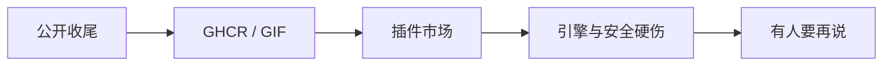

# Roadmap

> **用途**：公开后「接下来做什么」。  
> **远程**：[qualitest-hq](https://github.com/qualitest-hq)  
> 不绑定硬性日期；条目可能推迟、拆分或取消。

| 标记 | 含义 |
| ---- | ---- |
| 🚧 Now | 公开后立刻做 |
| 📋 Next | 下一阶段 |
| 🔭 Later | 尚未排期 |
| 🔬 Exploring | 评估中，不承诺 |



```text
Public + 分支保护 + Pages  >  GHCR  >  GIF（可补）  >  插件市场  >  跑流/密钥硬伤  >  其余看反馈
```

---

## 🚧 Now — 公开收尾

陌生人约 15 分钟内 clone → `docker compose up -d` → 登录。GIF **不阻塞公开**。

| ID | 任务 | 产出 |
| -- | ---- | ---- |
| 1.1 | 三仓改 **Public** | `qualitest` / `qualitest-demo` / `qualitest-intellij-plugin` |
| 1.2 | `main` 分支保护 / required checks | Free Org 仅 Public 后可用 |
| — | Dependabot + Secret scanning + Push protection | Settings → Code security |
| — | 落地页 Pages | Source = GitHub Actions；变量 `ENABLE_PAGES_DEPLOY=true`；About Website = `https://qualitest-hq.github.io/qualitest/`（见 [`site/README.md`](../site/README.md)） |
| — | 插件仓首个 tag `v1.0.0` | 触发 Release；公开前勿打 |

公开前抽查：SQL 种子无真实手机 / 邮箱 / 生产数据。README 标明生产须改默认口令与 `token.secret`。

**验收**

- [ ] 三仓 Public；分支保护已开  
- [ ] clone → compose up → 登录；可链到 demo 跑通主路径  
- [ ] CI 绿；无明文生产口令；落地页可打开  
- [ ] 插件 `v1.0.0` Release  

---

## 📋 Next

| ID | 任务 | 产出 |
| -- | ---- | ---- |
| 2.1 | GHCR 镜像 | `ghcr.io/qualitest-hq/qualitest`；README / [`deploy.md`](./deploy.md) 附 pull |
| 2.2 | 演示 GIF（暂缓） | README 嵌入 ≥2：`demo-api-console` / `demo-flow-canvas` / `demo-ai-diff` 或 `demo-mcp-cursor` |
| 2.3 | JetBrains 插件市场上架 | 审核通过；README 链到市场 |

---

## 🔭 Later

不绑版本号。公开后按 Issue / 真实踩坑再排；下面只是已知方向。

### 硬伤（用户能直接感到痛）

| ID | 任务 | 说明 |
| -- | ---- | ---- |
| 3.1 | 测试流超时 / 熔断 | `flow.node.timeout`、`flow.run.timeout` |
| 3.2 | 子流循环引用 / 深度限制 | 防跑飞 |
| 3.3 | AI apiKey 加密与日志脱敏 | 生产可信底线 |
| 3.4 | AI 连接测试 + LLM 韧性 | 超时 / 重试 / 熔断 |

生产须换强密钥，并关 Druid 或加白名单。

### 有空或有人要再说

| ID | 任务 |
| -- | ---- |
| 4.1 | 节点处理器 Spring 注入（`Map<String, NodeHandler>`） |
| 4.2 | 流程合并重构 + 补测（`GraphMerger` 等） |
| 4.3 | 事务 / 索引 / 分页 |
| 4.4 | 测试覆盖补强（对着真实 Bug 补，不为覆盖率） |
| 4.5 | 画布独立快照节点 |
| 4.6 | Dev Container / Codespaces |
| 4.7 | 前端打进 JAR（可选单容器） |
| 4.8 | MapStruct 收敛 DTO |
| 4.9 | GitHub Discussions |
| 4.10 | Dependabot 常态化合入 |
| 4.11 | 双远程：GitHub 为主，Gitee 只读镜像 |
| — | Helm Chart 实测（骨架已有，谁用谁验） |

---

## 发布约定

| 仓库 | 策略 |
| ---- | ---- |
| `qualitest` / `qualitest-demo` | semver；**不发** GitHub Release / 根目录 CHANGELOG |
| `qualitest-intellij-plugin` | 独立 semver；Release 附 ZIP；`changeNotes` 在 Gradle；公开日打 `v1.0.0`；修 BUG 升 PATCH |

---

## 仓库

| 仓库 | 端口 |
| ---- | ---- |
| [qualitest](https://github.com/qualitest-hq/qualitest) | Compose Web **80**；本机 API **8800** / UI **5180** |
| [qualitest-demo](https://github.com/qualitest-hq/qualitest-demo) | API **8801**；Compose UI **5181** |
| [qualitest-intellij-plugin](https://github.com/qualitest-hq/qualitest-intellij-plugin) | — |
