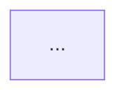

# 在 Cursor 中只读查看测试流画布

> **用途**：说明如何在 Cursor 里只读查看测试流拓扑（不改图）。  
> **不是**：改图画布、Staging、全自动写流 —— 见 [ai-staging.md](./ai-staging.md)、[mcp.md](./mcp.md)。

English: 暂无（需要时再补 `cursor-canvas-readonly.en.md`）。

---

## 1. 结论

| 侧 | 怎么看图 |
|:---|:---------|
| **Web** | Vue Flow 画布（可编辑）；**不**导出 Mermaid |
| **Cursor** | 调 `get_graph_summary`，用返回的 **`mermaid`** 字段（`flowchart TB` 正文）放进 markdown 代码块预览 |

**不新增** MCP 工具。数据真相仍是 `test_flow.graph_json`。

---

## 2. 用法

```text
list_flows → testFlowId → get_graph_summary
```

返回里除 `nodes` / `edges` 外，未压缩时带 `mermaid`。用户要看图时，Agent 应把该字符串原样放进：

````markdown

````

细节仍用 `get_node_detail`；勿贴整份 `graphJson`。

节点过多（> 80）且压缩、又无 `contextNodeIds` 时，可能省略 `mermaid`（与拓扑摘要压缩一致）。结果超字节上限时，适配器会先丢掉 `mermaid`，再减 edges/nodes。

---

## 3. Mermaid 约定

| `graph_json` | Mermaid |
|:-------------|:--------|
| 节点 `id` | 安全化后的键（非法字符 → `_`；纯数字前缀 `n`） |
| 多数类型 | 矩形 `["Type · name"]` |
| `condition` | 菱形 `{"…"}` |
| `subflow` | 子程序形 `[["…"]]` |
| 边 | `A --> B`；有 label 或 condition 分支名时 `A -->|label| B` |

实现：`FlowGraphMermaidSupport`（挂在 `GetGraphSummaryTool`）。

---

## 4. 不做

- Web 导出 Markdown / 新 REST
- 独立 `get_flow_mermaid` 工具
- 以 Mermaid 回写 `graph_json`
- 像素布局 / position

---

## 5. 相关文档

- [mcp.md](./mcp.md) — Cursor MCP 接入  
- [test-flow-nodes.md](./test-flow-nodes.md) — 八种节点  
- [ai-staging.md](./ai-staging.md) — 改图画布路径  
