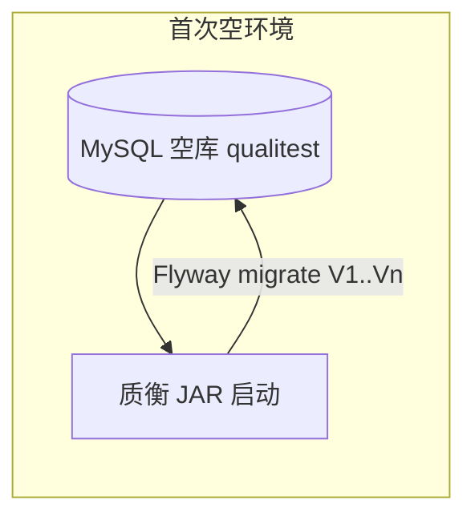

# Flyway 详解与质衡接入指南

> **状态**：已接入（路线图 **4.1**）。迁移脚本：`qualitest-admin/src/main/resources/db/migration/`。  
> 读者：要给质衡接库表版本管理、或想搞懂「为什么别再靠手工 `upgrade_*.sql`」的人。  
> 关联：[部署说明](./deploy.md) · [开源路线图 §7 / 4.1](./质衡开源与工程路线图.md)

---

## 1. 一句话

**Flyway = 数据库结构的 Git。**  
每个库结构变更是一份带版本号的 SQL（或 Java）脚本；应用启动时只跑「还没执行过」的脚本，并在库里记账。

| 维度 | 没有 Flyway（历史做法） | 有 Flyway（当前） |
|------|-------------------------|-------------------|
| 新环境 | Compose 挂 `sql/qualitest_*.sql` 进 `initdb.d`，或人肉导入 | 空库启动应用 → 自动迁到最新 |
| 已有环境升级 | 找文档 / 找同事要增量 SQL，顺序易错 | 拉代码重启 → 自动跑增量 |
| 「库停在哪一版」 | 靠记忆、靠 dump 文件名 | 查表 `flyway_schema_history` |
| 多人并行改表 | 容易互相覆盖 dump | 各加 `V{n}__….sql`，按版本号排队 |

---

## 2. 核心概念

### 2.1 Migration（迁移脚本）

一次不可逆（约定上）的库变更，常见两类：

| 类型 | 命名示例 | 用途 |
|------|----------|------|
| **Versioned** | `V2__add_flow_checkpoint.sql` | 正式升级，只执行一次 |
| **Repeatable** | `R__refresh_views.sql` | 内容变了就再执行（视图、存储过程等）；质衡初期可不依赖 |

Versioned 命名规则（Flyway 默认）：

```text
V{版本号}__{描述}.sql
 ↑        ↑↑
 前缀     两个下划线（必须）
```

- 版本号：`1`、`1.1`、`2`、`20260728.1` 均可；**按版本排序**，不是按文件名字符串瞎排。  
- 描述：只作人类可读，可用英文或拼音；**改描述会改 checksum**，已上线环境勿改已执行脚本内容。  
- 质衡约定建议：整数递增 `V1`、`V2`、`V3`…，描述用英文蛇形：`V3__add_api_group_index.sql`。

### 2.2 `flyway_schema_history`

Flyway 在目标库自动创建的账本表（默认名）。大致字段：

| 字段 | 含义 |
|------|------|
| `installed_rank` | 执行顺序 |
| `version` | 如 `2` |
| `description` | 如 `add flow checkpoint` |
| `checksum` | 脚本内容校验；**已执行后改文件会校验失败** |
| `success` | 是否成功 |

查当前版本（示例）：

```sql
SELECT version, description, installed_on, success
FROM flyway_schema_history
ORDER BY installed_rank;
```

### 2.3 Baseline（基线）

「这库已经有表了，别从 `V1` 空跑一遍 CREATE」。  
对**已有生产 / 长期本地库**，首次接入时常：

1. 把「当前结构」视为已到达某版本（如 `1`）；  
2. `baseline` 在 history 里记一笔，不真正执行 `V1`；  
3. 之后只跑 `V2`、`V3`…

空库则不需要 baseline：从 `V1` 顺序执行即可。

### 2.4 Validate / Repair / Clean

| 命令 / 动作 | 作用 | 生产 |
|-------------|------|------|
| **migrate** | 执行待跑脚本（Spring Boot 启动默认做这个） | 正常路径 |
| **validate** | 核对已执行脚本的 checksum 等 | 可开 |
| **repair** | 修 history（失败记录、checksum 对齐等） | 慎用，先备份 |
| **clean** | **删光**库里对象 | **禁止对生产**；仅一次性本地实验 |

---

## 3. 质衡现状与目标形态

### 3.1 历史做法（接入前）

```text
sql/qualitest_20260722_135127.sql     ← 整库 dump（结构 + 种子数据）
docker-compose.yml
  mysql 卷挂载 → /docker-entrypoint-initdb.d/01-qualitest.sql
                 （仅数据卷为空时执行一次）
本机开发：文档要求手动导入同份 SQL，或依赖上述 Compose 初始化
```

痛点：

- 改表往往改 dump 或另写增量，**已有卷不会重跑 initdb**（`deploy.md` 已说明要 `down -v` 才重初始化）。  
- 生产 / 老库无法「再跑一遍 dump」。  
- 路线图里写的历史 `upgrade_*.sql` 若再出现，仍靠人执行。

### 3.2 当前形态（阶段 4.1 已落地）

```text
qualitest-admin/src/main/resources/db/migration/
  V1__baseline.sql          ← 由 dump qualitest_20260722_135127 整理（结构 + 必要种子）
  V2__….sql                 ← 之后每个功能只加增量
应用启动（Spring Boot + Flyway）→ migrate → 库对齐代码版本
Compose：MySQL 只建空库（MYSQL_DATABASE），不再把巨型 dump 塞进 initdb.d
sql/qualitest_*.sql         ← 可保留作「灾难备份 / 离线导出」，不再作为唯一升级路径
```

---

## 4. 推荐目录与模块

Spring Boot 默认扫描：

```text
classpath:db/migration
```

质衡启动模块是 `qualitest-admin`，建议：

```text
qualitest-admin/src/main/resources/db/migration/
  V1__baseline.sql
  V2__….sql
```

若希望 SQL 与 admin 解耦、便于单测引用，也可放在 `qualitest-system/src/main/resources/db/migration/`，并在配置里写：

```yaml
spring:
  flyway:
    locations: classpath:db/migration
```

（资源打进最终可运行 JAR 的 classpath 即可；**不要**只放在仓库根 `sql/` 却不进 JAR。）

根目录 `sql/` 建议职责划分：

| 路径 | 接入 Flyway 后 |
|------|----------------|
| `sql/qualitest_*.sql` | 可选：运维全量备份；或生成 `V1` 的原料；**新变更禁止只改 dump 不写 migration** |
| `sql/backup_db.bat` / `restore_backup.bat` | 保留，与 Flyway 无关 |
| `sql/reset_business_data.sql` | 开发清业务数据用，**不要**当成 versioned migration（会误伤） |

---

## 5. 与 Compose / 本机开发怎么配合

### 5.1 推荐模型（应用负责迁移）



1. Compose 里 MySQL：环境变量创建库名 `qualitest`，**去掉**（或不再依赖）`initdb.d` 里的整库 dump。  
2. `qualitest-app` / 本机 `mvn spring-boot:run` 启动时 Flyway 建表 + 种子。  
3. 已有数据卷：走 §7「存量库 baseline」，不要对脏卷直接塞 `V1` 全量 `CREATE`。

### 5.2 为何不建议「initdb 跑完整 V1，应用再跑 V2+」长期双轨

可以短期过渡，但要同时维护：

- initdb 用的文件  
- Flyway history 是否已 baseline  

双轨一久，新人必懵。**目标收敛为：只认 Flyway。**

### 5.3 本机只起 MySQL + Redis 时

```bash
docker compose up -d mysql redis
# 库是空的 → 再启动 qualitest-admin，由 Flyway 灌结构
```

`docs/deploy.md` 已改为上述表述（空库 + 应用 Flyway，不再要求手导 dump 为唯一路径）。

---

## 6. Spring Boot 3.x 接入步骤（实施 checklist）

> 质衡：Spring Boot **3.5.x**、MySQL **8**、数据源为 **Druid master**（非默认 `spring.datasource.url`）。  
> **必须显式配置 Flyway 的 jdbc url / 账号**，否则容易「Flyway 找不到数据源」或连错库。

### 6.1 Maven

在 **`qualitest-admin`**（启动模块）增加：

```xml
<!-- 版本由 spring-boot-dependencies BOM 管理时可省略 version -->
<dependency>
    <groupId>org.flywaydb</groupId>
    <artifactId>flyway-core</artifactId>
</dependency>
<dependency>
    <groupId>org.flywaydb</groupId>
    <artifactId>flyway-mysql</artifactId>
</dependency>
```

MySQL 8 需要 `flyway-mysql` 模块，只加 `flyway-core` 可能报数据库支持问题。

### 6.2 配置（示例）

`application.yml` 或各 profile（dev / docker / prod）中与数据源并列：

```yaml
spring:
  flyway:
    enabled: true
    # Druid 多数据源时务必显式指定（与 master 一致）
    url: ${SPRING_DATASOURCE_DRUID_MASTER_URL:jdbc:mysql://localhost:3306/qualitest?useUnicode=true&characterEncoding=utf8&serverTimezone=GMT%2B8}
    user: ${SPRING_DATASOURCE_DRUID_MASTER_USERNAME:root}
    password: ${SPRING_DATASOURCE_DRUID_MASTER_PASSWORD:123456}
    locations: classpath:db/migration
    baseline-on-migrate: false   # 空库新环境用 false；存量见 §7
    baseline-version: 1
    validate-on-migrate: true
    # 编码
    encoding: UTF-8
    # 是否允许乱序（多人分支易撞车时慎开）
    out-of-order: false
```

说明：

- `enabled: false` 可临时关掉（应急）；生产默认应 `true`。  
- 测试 profile 若用 H2，需另配或关闭 Flyway，避免 MySQL 脚本在 H2 上炸。

### 6.3 制作 `V1__baseline.sql`

1. 取当前权威 dump：`sql/qualitest_20260722_135127.sql`（以仓库最新为准）。  
2. 整理建议：  
   - 去掉 mysqldump 噪音头尾中与迁移无关、且易导致重复执行失败的部分（按团队规范）；  
   - **`CREATE DATABASE` / `USE`**：Flyway 已连上目标库，脚本内一般 **不要**再 `CREATE DATABASE`；  
   - 保留 `CREATE TABLE`、必要 `INSERT` 种子（admin 用户、菜单、字典等）；  
   - `DROP TABLE IF EXISTS`：空库无所谓；对「误对非空库跑 V1」很危险——靠 baseline 流程避免对存量跑 V1。  
3. 放入 `db/migration/V1__baseline.sql`。  
4. **空库**启动一次，确认：表齐全、能登录、`flyway_schema_history` 有 `1` 且 success。

### 6.4 改 Compose

- 删除或停用：`./sql/qualitest_….sql:/docker-entrypoint-initdb.d/...`  
- 保证 MySQL 服务仍创建空库 `MYSQL_DATABASE=qualitest`  
- 文档写清：首次启动以 **app 健康 / 日志出现 Flyway migrate 成功** 为准，而不是 initdb 跑完

### 6.5 验证矩阵

| 场景 | 期望 |
|------|------|
| 全新 `docker compose down -v && up` | 空库 → 应用起来 → 表与种子齐全 |
| 本机空库 + `spring-boot:run` | 同上 |
| 已 baseline 的库再启动 | 无待跑脚本则秒过；加 `V2` 后只执行 `V2` |
| 故意改已执行的 `V1` 内容再启动 | validate 失败，启动失败（符合预期） |

---

## 7. 存量库怎么接（本地有数据 / 将来生产）

**禁止**对已有业务库直接执行完整 `V1__baseline.sql`（里面通常有 `DROP` / 重复 `CREATE`）。

推荐流程：

```text
1. 备份库（sql/backup_db.bat 或 mysqldump）
2. 确认当前库结构 ≈ 即将入库的 V1 所描述的结构
3. 配置临时：
     spring.flyway.baseline-on-migrate: true
     spring.flyway.baseline-version: 1
4. 启动一次 → history 出现 baseline 记录（版本 1），不跑 V1 文件体
5. 改回 baseline-on-migrate: false（或仅保留在「迁移专用 profile」）
6. 之后只通过 V2、V3… 升级
```

若存量库**落后于** V1 脚本所描述的结构：先人工把库升到与 V1 一致，再 baseline；或把差异拆成 `V2` 起的增量，V1 仅代表更老的基线——需团队选一种，**不要混合猜测**。

---

## 8. 日常开发约定（接上之后）

### 8.1 加字段 / 加表

1. 只新增 `V{n}__short_desc.sql`，**禁止**只改旧的 `V1` 或只改根目录 dump。  
2. PR 描述写明：迁移版本号、是否含数据回填、是否可回滚（多数 DDL 不自动回滚）。  
3. 本地先空库或副本验证 migrate；再在有数据的库试一次。

### 8.2 脚本编写注意（MySQL）

- 一条 migration 尽量单一主题（一个功能一块变更）。  
- 大表加索引考虑在线策略；避免长时间锁表无说明。  
- 慎用存储过程 / 触发器；需要时可用 Repeatable。  
- Flyway 默认按分隔符拆语句；复杂存储过程可能要调整 `sql-migration-separator` 或拆文件——遇到再查官方文档。  
- **不要**在 migration 里写依赖本机路径的 `LOAD DATA`。

### 8.3 分支协作与版本号

- 两人同时加 `V5` → 合并冲突：留下一个 `V5`，另一个改成 `V6`。  
- `out-of-order: true` 能让晚合并的低版本在高版本之后补跑，但历史更乱；团队小建议 **false + 合并时改号**。

### 8.4 绝对不要做的事

| 行为 | 后果 |
|------|------|
| 修改已在多人/生产执行过的 migration 文件内容 | checksum 失败，全员启动挂 |
| 生产开 `clean` | 删库级灾难 |
| 用 Flyway 跑「清空业务数据」脚本当 versioned | 每个新环境都被清空逻辑绑死 |
| 一半人改 dump、一半人写 migration | 双轨漂移，4.1 白做 |

若必须修正已发布脚本：发 **新的** `V{n+1}` 做正向修复；或极少数情况 `repair` + 团队对齐（要写进事故记录）。

---

## 9. 回滚怎么看

Flyway Community **没有**自动 down 脚本（那是 Flyway Teams 等能力，或 Liquibase 的 changeset 风格）。

质衡实用策略：

1. **向前修**：`V{n+1}` 把错误改回来（删错列、补数据）。  
2. 发布前在副本验证。  
3. 真正灾难：备份还原（`restore_backup.bat` / 快照），再对齐 `flyway_schema_history`。

不要假设「Git revert migration 文件 = 库自动回去」。

---

## 10. 与路线图其它项的关系

| 项 | 关系 |
|----|------|
| **v1.0 公开** | **不依赖** Flyway；继续 dump + initdb 即可 |
| **4.1 Flyway** | 本文实施对象；估 3～5 天（含整理 V1、改 Compose、存量说明、改 deploy） |
| **4.2 demo Profile** | demo 库可另套 Flyway 或继续独立 SQL；主库与靶场库分开 |
| **4.7 / deploy** | 升级说明写进 `docs/deploy.md`，链到本文 |
| **不维护 CHANGELOG** | 库变更以 `db/migration` 文件列表为准 |

---

## 11. 实施任务拆分（可当 4.1 工单）

- [x] admin 引入 `flyway-core` + `flyway-mysql`  
- [x] 各 profile 配置 `spring.flyway.*`（**显式 url/user/password**）  
- [x] 从当前 `sql/qualitest_*.sql` 整理 `V1__baseline.sql`  
- [x] 空库启动验证 + 登录冒烟  
- [x] Compose 去掉 initdb 整库挂载；文档同步  
- [x] 写清存量库 baseline 步骤（本文 §7，可缩写进 deploy）  
- [x] 约定：新功能只加 `V{n}`；PR 模板可加一句「是否含 DB migration」  
- [ ] （可选）CI 起 MySQL 服务跑一次 migrate（与单元测试 Job 分离）  
- [x] 路线图 4.1 / checklist 勾选；deploy 去掉「必须手导 dump」为唯一路径  

---

## 12. 常见报错速查

| 现象 | 可能原因 | 处理 |
|------|----------|------|
| `Unsupported Database` | 缺少 `flyway-mysql` | 补依赖 |
| 启动连库失败 / Flyway 无 datasource | 只用了 Druid master，未配 `spring.flyway.url` | 显式配置 |
| `Checksum mismatch` | 改了已执行脚本 | 还原文件；或新版本修复；勿随便 repair 糊弄生产 |
| `Found non-empty schema without metadata` | 存量库未 baseline | §7 |
| `Migration … failed` 停在半截 | SQL 写错 / 语法 | 修脚本；失败行在 history 里；修后常需 `repair` 清失败记录再 migrate（先备份） |
| Compose 有表但应用又报错 | initdb 与 Flyway 双轨、版本不一致 | 统一只走 Flyway；脏卷 `down -v` 仅限可丢数据环境 |

---

## 13. 官方与延伸阅读

- [Flyway 文档](https://documentation.red-gate.com/flyway)  
- [Spring Boot Flyway](https://docs.spring.io/spring-boot/reference/howto/data-initialization.html#howto.data-initialization.migration-tool.flyway)  
- 同类工具：[Liquibase](https://www.liquibase.org/)（XML/YAML changeset；质衡路线图选定 Flyway，不必并行两套）

---

## 14. 备忘（给实施的人）

```text
空库    → 直接 migrate（V1…Vn）
老库    → 备份 → baseline-on-migrate 一次 → 以后只加增量
新功能  → 只加 V{n}__….sql，不改历史文件，不靠改 dump「顺便升级」
生产    → 禁 clean；改脚本靠新版本；出事靠备份
质衡坑  → Druid master 必须给 Flyway 单独配 url/user/password
```

*文档版本：2026-07-30 · 对应路线图任务 4.1 · 已接入；基线原料 `sql/qualitest_20260722_135127.sql`*
