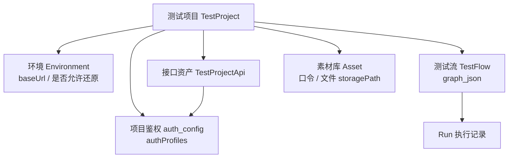

# 质衡 · 产品概念地图

> **用途**：一屏看清「系统里有什么、主链路怎么走、文档去哪找」。  
> **不是**：部署手册、节点字段字典、测试勾选表 —— 那些见文末索引。  
> 英文：[project-summary.en.md](./project-summary.en.md)

---

## 1. 工作区地图


| 目录                           | 角色                                         |
| ---------------------------- | ------------------------------------------ |
| `qualitest/`                 | 主平台后端（Spring Boot）+ `qualitest-ui/` 前端 SPA |
| `qualitest-demo/`            | 可选商城接口靶场（独立 Compose；`/test-support` 快照样板）  |
| `qualitest-intellij-plugin/` | IDEA 插件：扫描 Controller → 上传接口资产             |


前后端经 REST/JSON 通信；跑流与调试默认打项目环境的 `baseUrl`（Demo 常见 `http://localhost:8081`）。

---

## 2. 核心对象




| 对象       | 一句话                                                         |
| -------- | ----------------------------------------------------------- |
| **测试项目** | 隔离边界：成员、Token、接口、流、素材、鉴权都挂项目                                |
| **环境**   | 被测 `baseUrl`；可选「允许还原被测数据」（开则同环境串行 Run）                      |
| **接口资产** | method/path/schema/测值/鉴权 mode；来自插件上传或模板预制                   |
| **测试流**  | 画布图（固定 7 种节点）；改图走 AI Staging 或属性面板                          |
| **素材库**  | 可复用测值；登录口令优先 `{{asset.*}}`；文件走 `storagePath` → multipart    |
| **Run**  | 一次执行；详情含时间线、HTTP、审计步（`run_config` / `snapshot` / `restore`） |


跑流变量：`{{flow.*}}` · `{{env.*}}` · `{{asset.*}}`（详见 [flow-variables-and-values.md](./flow-variables-and-values.md)）。`session` 仅 Script 节点；断言左值见 [test-flow-nodes.md](./test-flow-nodes.md)。

---


## 3. 主链路（人可复现）

```text
IDEA 插件上传接口
  → 调试台单接口验证（选环境）
  → 新建/打开测试流
  → AI 助手自然语言造流或修复
  → Staging 逐项 ✓ 确认（禁止空 nodes 当成功）
  → 保存（画布可见节点）
  → Run → 看详情 / 失败则 AI 修复或手改
```


| 原则          | 说明                                        |
| ----------- | ----------------------------------------- |
| **改图画布**    | Web AI → Staging → 保存；规则见 [ai-staging.md](./ai-staging.md)；MCP **只读** |
| **Staging** | ✓ = 确认提案；删除类 ✓ = 唯一确认；空 `nodes` 不算成功 |
| **鉴权**      | 挂**项目**，不挂环境；见 §4                         |
| **写库场景**    | 靶场先加载场景；节点可勾「执行前快照」；还原需被测 `/test-support` |


验收口径与 Agent 铁律见 [全面测试手册.md](./全面测试手册.md) §B.0.1。

---


## 4. 项目鉴权

配置在测试项目设置抽屉「项目鉴权」。造流 Normalizer、Run、调试台共用同一解析器。

### 4.1 模板与 Profile


| 概念                      | 要点                                                                          |
| ----------------------- | --------------------------------------------------------------------------- |
| `test_project_template` | 一行模板 = 一条 Profile；内置 RuoYi Bearer / Session、客户端 Bearer、管理端 Bearer           |
| Apply                   | 勾选后拷入项目 `authProfiles`（**新生成 id**）；按 `templateApis[]` 插入预制接口（已有 method+path **跳过**）；可选种子 `templateParams`（flow→场景 flowSeed / env→环境变量 / asset→素材库）与 `templateFlows`（同名流跳过）；托管头与 `loginHint` 从登录流 extracts **派生** |
| 新建项目                    | **至少勾一套**；商城双端建议先「管理端 Bearer」再「客户端 Bearer」                                  |
| 免登                      | 认预制 `apis[].authConfig.mode=none`；**不再**维护项目级匿名 path 清单                     |
| 空配置                     | 才暂留 builtin `/login` 等启发式；有 Profile 但 apis 空 → 设置页黄条提示补模板                   |


### 4.2 三层叠加


| 层级                | 要点                                                                            |
| ----------------- | ----------------------------------------------------------------------------- |
| 项目 `authProfiles` | 头模板 + `credentialApi` + `loginHint` + 预制 `apis[]`；未命中 `pathPrefix` 用**数组第一条** |
| 接口 `auth.mode`    | `inherit` → 项目 Profile；`none` 不加头；`override` 用本接口头模板。接口行**不写** `loginHint`    |
| 节点 headers        | 托管头带 `profileManaged`，Run 按**当前**配置刷新；无该标记的显式头永不被静默改掉                         |


**匹配**：接口指定 `authProfileId` 优先；否则最长 `pathPrefix`；无人命中用数组第一条。**禁止** `pathPrefix="/"`。

**登录抽凭证**：extracts 的 `from`+`expr` 对齐 **Profile.**`loginHint`（接口须命中该条 `credentialApi`），写入 `flow.token` / `flow.adminToken` 等。注册/验证码不抽凭证。造流时空 extracts 会按 hint 补；缺对应 extract 硬拦（`AUTH_LOGIN_EXTRACT_MISSING`）。上传/OpenAPI 只改接口行 schema 与 mode，**不改**项目 Profile hint。

### 4.3 双端与门禁


| 端   | 典型 path                   | extract                       |
| --- | ------------------------- | ----------------------------- |
| 客户端 | `/api/account/auth/login` | `$.data.token` → `flow.token` |
| 管理端 | `/login`                  | `$.token` → `flow.adminToken` |


- **同端**：开头只登录一次（或挂登录子流），后续靠托管 Bearer 复用 `flow.`*。
- **双端同图**：两套登录、两套 extracts；**禁止**覆盖同一个 `flow.token`（硬拦 `AUTH_LOGIN_FLOWKEY_COLLISION`）。
- **其它硬拦**：缺对应端 token 来源 → `AUTH_TOKEN_MISSING`（AI submit / Staging / 保存）。托管头补全为 soft warning（`AUTH_HEADER_MANAGED`）。
- 画布顶栏「刷新鉴权头」、HTTP 节点凭证行提示；Run 鉴权失败可用「AI 修复」。
- 调试可用 flowSeed 预置 token；**口令仍走素材库**，勿 flowSeed 塞密码。

验收步骤见手册 **T1.2**（项目模板）、**T1.8**（登录子流）、§F #21/#24。

### 4.4 写操作与快照

HTTP 节点可勾 **执行前快照**（`snapshotBefore`）。失败可暂停，由用户选择还原再重试 / 原地重试 / 跳过 / 中止。被测方需 `/test-support`；环境 `allowDestructiveReset=0` 时 checkpoint/restore 静默跳过。**开启还原时同一环境串行跑。**

---


## 5. AI、Staging 与常见门禁

细则：[ai-staging.md](./ai-staging.md) · [flow-variables-and-values.md](./flow-variables-and-values.md) · [assets.md](./assets.md) · [faq.md](./faq.md)

| 主题      | 口径                                                     |
| ------- | ------------------------------------------------------ |
| 造流      | 提示集 + 真实 apiId；长流**新对话 + 短提示**；「本轮未提交 Staging」= 未落盘   |
| Staging | 全部 ✓ 再保存；删除 ✓ 无二次弹窗；MCP 不能 `submit`                     |
| 失败路径    | 「预期业务拒绝」+ 字面量；成功路径才用 `{{asset.*}}`                     |
| 素材 / 文件 | 口令进素材库；file → `storagePath` → multipart                |
| MCP     | 只读勘察；改图回 Web                                           |


---


## 6. 文档索引


| 文档                                                               | 何时看             |
| ---------------------------------------------------------------- | --------------- |
| **本文** | 概念、鉴权、主链路 |
| [test-flow-nodes.md](./test-flow-nodes.md) | 7 种节点与断言方言 |
| [ai-staging.md](./ai-staging.md) | AI Diff / Staging 确认 |
| [flow-variables-and-values.md](./flow-variables-and-values.md) | 跑流变量与 HTTP 测值 |
| [assets.md](./assets.md) | 素材库与测参文件 |
| [faq.md](./faq.md) | 日常使用疑问（非冒烟专项） |
| [全面测试手册.md](./全面测试手册.md) | T1→T3 验收与 §F/§G |
| [mcp.md](./mcp.md) | MCP Token 与只读工具 |
| [deploy.md](./deploy.md) | 部署 / Compose |
| [测试编写约定.md](./测试编写约定.md) | 工程测试约定 |
| [质衡开源与工程路线图.md](./质衡开源与工程路线图.md) | 排期与待办 |
| [Demo AI 提示集](../../qualitest-demo/docs/ai-test-flow-prompts.md) | 靶场造流提示正文 |


