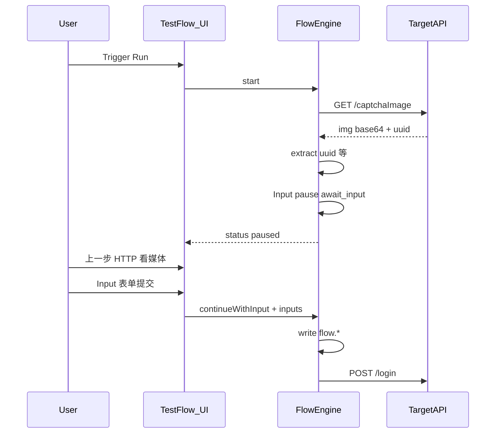

# 响应媒体预览与 Input 节点方案

> **状态：方案稿（未实现）**  
> 背景：若依类 `/captchaImage` 可作免登接口种子，但开验证码时登录链缺「看图」与「人手填码」能力。  
> 相关：[`test-flow-nodes.md`](./test-flow-nodes.md)、[`project-template.md`](./project-template.md)（用法）/ [`project-template/`](./project-template/)（契约）、子流 `tpl_login_captcha`（外联打码）。

---

## 1. 现状与缺口

| 点 | 现状 |
|----|------|
| `/captchaImage` | 精简模板可种子为免登 API；响应多为 JSON（`img` base64 + `uuid` + 可选 `captchaEnabled`），不是裸 `image/*` |
| 调试 / Run 展示 | Body 当纯文本 / `JSON.stringify`；长 base64 **不渲染**为图/音视频 |
| 登录主路径 | 精简包不造流；内置「探活再登录」**不插** captcha（captcha 仅种子） |
| 自动化绕过 | 子流 `tpl_login_captcha`：取图 → **外联打码** `env.captchaApiUrl` → 登录 |
| 画布节点 | 固定 7 种：`http` / `assert` / `condition` / `assign` / `delay` / `script` / `subflow` |
| 暂停 / 续跑 | `paused` 服务节点失败 / 快照失败；`ResumeTestFlowRunParams` 仅有 `decision` + `snapshotId`，**不能注入** `flow.*` |

结论：接口能调通，开验证码时仍「用不完」——缺 **HTTP 响应侧媒体预览** 与 **交互式人工输入节点**。

---

## 2. 职责拆分（定案）

| 职责 | 落点 | 不做什么 |
|------|------|----------|
| 媒体预览 | HTTP 响应展示：API 调试 Body + Run 步骤 HTTP Inspector（共用 `responseMediaPreview`） | **不**塞进 Input |
| 手动输入 | 新节点 `input`：prompt + 多类型 fields → 暂停 → 写入 `flow` → 继续 | **无**预览字段 / 关联图配置 |

交互跑验证码：Run 时间线点开**上一步 HTTP** 看图 → 暂停面板填 Input → `continueWithInput`。



---

## 3. 阶段 1：HTTP 响应媒体预览

### 3.1 工具 `responseMediaPreview`（新建）

- 建议路径：`qualitest-ui/.../utils/responseMediaPreview.ts`
- 输入：`body` / `bodyText` / `headers` / `bodyBase64`（及截断标记）
- 输出：`{ kind, src, mime, truncated? }` 或 `null`
- UI 组件建议：`ResponseMediaPreview.vue`，按 `kind` 渲染

### 3.2 支持矩阵

| kind | 识别来源 | 渲染 |
|------|----------|------|
| `image` | CT `image/*`；`data:image`；字段 `img` / `image` / `captcha` / `avatar` 等 base64 或 URL | `` |
| `video` | CT `video/*`；`data:video`；字段 `video` / `videoUrl` / `url` | `<video controls>` |
| `audio` | CT `audio/*`；`data:audio`；字段 `audio` / `audioUrl` | `<audio controls>` |
| `pdf` | CT `application/pdf`；`data:application/pdf`；字段 `pdf` / `fileUrl` | `<iframe>` 或新窗口 |
| `link` | 其它 `http(s)` 媒体 URL | 能播用标签，否则外链 |

**JSON 内嵌（验证码主路径，可不改 body 编码）**

1. `data:<mime>;base64,...` → 按 mime 定 kind  
2. 常见字段纯 base64 → 按字段名猜默认 mime（`img` → `image/gif`，对齐管理端登录页；`video` → `video/mp4`）  
3. `http(s)://` → 扩展名 / 路径猜 kind；失败则外链  

**裸二进制响应**

现状：`DebugHttpForwardServiceImpl.decodeBodyPreview` 一律 UTF-8，会损坏 `image/*` / `video/*`。

调试转发结果拟增加：

| 字段 | 含义 |
|------|------|
| `bodyEncoding` | `text` \| `base64` |
| `bodyBase64` | CT 为 `image/*` \| `video/*` \| `audio/*` \| `application/pdf`（及可识别的 `octet-stream`）时填充 |
| `bodyText` | 二进制时可改为短提示，如 `[binary image/png · N bytes]` |

沿用 `MAX_RESPONSE_BYTES` 截断；`truncated` 时预览区标明可能无法完整播放。

Run HTTP Inspector：本阶段以步骤内已有 JSON/文本 body 为主（必支持 `img` / `data:`）；步骤级 `bodyBase64` 可与调试约定对齐，不强制本阶段改执行落库格式。

### 3.3 前端挂载点

- `ApiDebugTab.vue`：Body 上方预览，文本区保留  
- `RunDetailPanel.vue` HTTP Inspector：同上  

### 3.4 明确不做

- HLS/DASH（`m3u8`）完整播放器  
- docx/xlsx 等办公预览  
- 突破响应截断的超大视频完整缓存  
- Input 节点任何预览字段  

---

## 4. 阶段 2：交互式 `input` 节点

### 4.1 节点概要

- 新画布 type：`input`（第 8 种；实现时同步改「固定 7 种」文档与规则）  
- 只负责收人手值 → 写 **`flow`**；无媒体预览配置  

### 4.2 字段类型

`fields[]` 每项带 `type`（缺省 `text`）：

| type | UI | 写入 `flow` | 备注 |
|------|-----|-------------|------|
| `text` | 单行 | string | 验证码 / 短信码 |
| `textarea` | 多行 | string | |
| `password` | 密码框 | string | 仅 UI 掩码；报告脱敏另议 |
| `number` | 数字 | number | |
| `boolean` | 开关 | boolean | |
| `select` | 单选 | string（`option.value`） | 静态 `options` |
| `multiselect` | 多选 | string[] | 静态 `options` |
| `date` | 日期 | `YYYY-MM-DD` | |
| `datetime` | 日期时间 | ISO-8601 本地串，如 `2026-09-06T17:00:00` | |

`options`（仅 select / multiselect）：`[{ "label", "value" }, ...]`，**设计期静态**（本阶段不做从 `flow.*` 动态拉选项）。

可选：`placeholder`、`defaultValue`（与 type 匹配）。未知 `type` 保存/校验硬拦。

示例：

```json
{
  "name": "补全登录信息",
  "prompt": "请填写后继续",
  "fields": [
    { "name": "captchaCode", "label": "验证码", "type": "text", "required": true },
    {
      "name": "loginChannel",
      "label": "登录通道",
      "type": "select",
      "required": true,
      "options": [
        { "label": "管理端", "value": "admin" },
        { "label": "客户端", "value": "client" }
      ]
    },
    {
      "name": "tags",
      "label": "标签",
      "type": "multiselect",
      "options": [
        { "label": "冒烟", "value": "smoke" },
        { "label": "回归", "value": "reg" }
      ]
    },
    { "name": "bizDate", "label": "业务日", "type": "date", "required": false }
  ]
}
```

### 4.3 运行时（扩展现有 pause / resume）

| 项 | 约定 |
|----|------|
| 暂停原因 | `await_input`（`RunExecutionState.PAUSE_REASON_AWAIT_INPUT`） |
| 可用决策 | `continueWithInput`、`abort`（不做 skip） |
| Resume | `inputs: Map<String, Object>`（string / number / boolean / array） |
| 续跑 | 按 type 校验 → 写入 `flow` → Input 步 passed → **从下一节点继续** |

校验：`required`；select/multiselect 值落在 `options[].value`；number/boolean/date/datetime 形态合法；`required` 的多选不允许空数组。

`RunPauseInfo` 带回 `prompt` + 完整 `fields`（含 type/options），供前端按类型渲染。

无人值守 / CI：碰到 Input 进入 `paused`；调度主路径继续用外联打码或关闭被测验证码。

### 4.4 实现落点（实现时参考）

**后端：** `FlowNodeType`、`GraphJsonValidator`、`InputNodeHandler`、`InputFieldTypes`、`NodeHandlerRegistry`、`FlowGraphRunner` / `TestFlowExecutor`、`ResumeTestFlowRunParams`、`RunPauseInfo`。

**前端：** `nodeTypes` / `nodeRegistry`、`InputNode.vue`、`InputPropertySection.vue`、`RunDetailPanel` 暂停表单、`testFlowRun.ts`（`inputs: Record<string, unknown>`）。

**本阶段不做：** 动态 options、文件上传、富文本、级联、直写 `asset.*`（需要时下游 Assign）。

### 4.5 模板与文档（实现时）

- 新增子流 `tpl_login_captcha_manual`：HTTP 取验证码 → Input → 登录；**不改**现有外联打码模板  
- 更新 `test-flow-nodes.md`（及 en）、后端规则中「固定 7 种」  
- 精简项目模板 / `AI_PROMPT.md` 仍不自动生成含 Input 的 flows  

---

## 5. 建议落地顺序（未开工）

1. **1a** 前端 `responseMediaPreview`（JSON / `data:` / URL）→ 覆盖验证码图  
2. **1b** 调试转发 `bodyEncoding` / `bodyBase64` → 裸二进制图 / 音视频 / PDF  
3. **2** Input 后端契约 → 画布与暂停表单 → `tpl_login_captcha_manual` + 节点文档  

**验收草稿：** API 调试可见 captcha 图；可选验证 `video/*` 或 JSON 视频 URL；Run「取图 HTTP → Input → 登录」→ 上一步看图 → 填码 → 探活成功。

---

## 6. 关键代码索引（只读参考）

| 区域 | 路径 |
|------|------|
| 调试转发 | `qualitest-system/.../DebugHttpForwardServiceImpl.java` |
| 暂停状态 | `qualitest-system/.../RunExecutionState.java` |
| 续跑参数 | `qualitest-system/.../ResumeTestFlowRunParams.java` |
| 节点枚举 | `qualitest-system/.../FlowNodeType.java` |
| API 调试 UI | `qualitest-ui/.../ApiDebugTab.vue` |
| Run 详情 | `qualitest-ui/.../RunDetailPanel.vue` |
| 外联打码子流 | `qualitest-system/.../ai/subflow-templates/tpl_login_captcha.graph.json` |
| 管理端看图参考 | `qualitest-ui/.../views/login.vue`（`data:image/gif;base64,`） |
