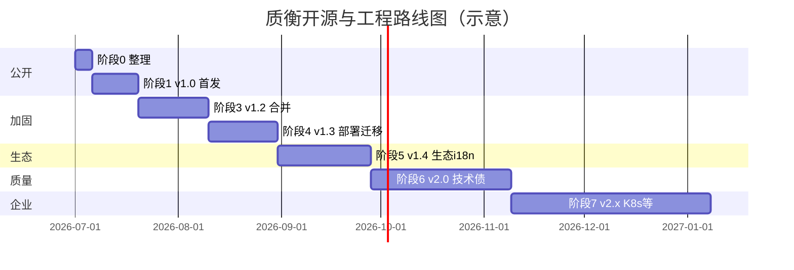

# 质衡（Qualitest）开源与工程路线图

> **唯一总文档**：整合原《开源筹备指南》《代码优化清单》《冲 500 Star 最小开源包》，按 **阶段** 排列全部工作项（含 UI 合并、demo 进 Compose、Flyway、K8s、前端重构、插件市场上架、英文全文档等）。被测数据快照 / 还原重试已交付，见 [§5](#5-已交付能力被测数据快照与还原重试)。  
> 工作区：`qualitest-all`（`qualitest` · `qualitest-ui` · `qualitest-demo` · `qualitest-intellij-plugin`）  
> 维护：实施前以最新代码为准；完成阶段后在 §16 总 checklist 勾选。

---

## 目录

1. [现状与目标](#1-现状与目标)
2. [阶段总览](#2-阶段总览)
3. [阶段 0：开源前整理](#3-阶段-0开源前整理不公开)
4. [阶段 1：v1.0 公开首发](#4-阶段-1v10-公开首发约-2-周冲-500-star)
5. [已交付能力：被测数据快照与还原重试](#5-已交付能力被测数据快照与还原重试)
6. [阶段 3：v1.2 仓库合并与体验加固](#6-阶段-3v12-仓库合并与体验加固)
7. [阶段 4：v1.3 部署与数据迁移体系](#7-阶段-4v13-部署与数据迁移体系)
8. [阶段 5：v1.4 生态与国际化](#8-阶段-5v14-生态与国际化)
9. [阶段 6：v2.0 代码质量与稳定性](#9-阶段-6v20-代码质量与稳定性)
10. [阶段 7：v2.x 企业交付与进阶工程化](#10-阶段-7v2x-企业交付与进阶工程化)
11. [技术债明细（按优先级）](#11-技术债明细按优先级)
12. [部署方案详述](#12-部署方案详述)
13. [社区运营与 Star 预期](#13-社区运营与-star-预期)
14. [仓库组织、协议与安全](#14-仓库组织协议与安全)
15. [发布策略与长期维护](#15-发布策略与长期维护)
16. [总 checklist（按阶段勾选）](#16-总-checklist按阶段勾选)
17. [附录](#17-附录)

---

## 1. 现状与目标

### 1.1 当前结构


| 目录                          | Git 仓库    | 远程（当前）   | 说明                                |
| --------------------------- | --------- | -------- | --------------------------------- |
| `qualitest`                 | 独立        | Gitee 私有 + GitHub `qualitest-hq` 私有（单 commit 备份，**已含 `qualitest-ui/`**） | 后端主平台（Spring Boot 多模块） + 前端目录 |
| `qualitest-ui`              | 独立（Gitee） | Gitee 私有；GitHub 无独立仓（内容在主仓 `qualitest/qualitest-ui/`） | 前端 Yarn workspace；本地兄弟目录仍可用于 Gitee 开发 |
| `qualitest-demo`            | 独立        | Gitee 私有 + GitHub `qualitest-hq` 私有（单 commit 备份） | 接口测试靶场（商城业务，8081）                 |
| `qualitest-intellij-plugin` | 独立        | Gitee 私有 + GitHub `qualitest-hq` 私有（单 commit 备份） | IDEA 插件（QualiTest Helper）         |
| `qualitest-all`             | **无 Git** | —        | 本地聚合工作区                           |


### 1.2 目标


| 维度       | 目标                                                 |
| -------- | -------------------------------------------------- |
| **产品**   | 「5 分钟跑起来」；体验测试流编排、AI Diff、IDEA 同步、MCP、**数据快照还原重试** |
| **技术**   | 单仓 clone（阶段 3 后）、CI 绿、文档可搜、Compose 一键体验            |
| **品牌**   | 「接口测试 / 测试编排 / AI 测开」赛道可识别 **Qualitest / 质衡**      |
| **Star** | v1.0 首发后首年 **500～800**（少运营）；全阶段到位 **1500～3000**    |


### 1.3 参与者价值（摘要）

贡献者可获得：全栈真实项目经验、Code Review 文化、测试流 / AI / IDEA 插件 / MCP 等细分方向作品、简历可引用的公开 PR。  
维护者需配合：`good first issue`、48h 内回复 Issue/PR、CONTRIBUTING 清晰、Release 致谢、README 承诺与 `main` 一致。

---

## 2. 阶段总览




| 阶段    | 版本         | 周期（估）     | 核心交付                                        | Star 贡献        |
| ----- | ---------- | --------- | ------------------------------------------- | -------------- |
| **0** | —          | 3～5 天     | 密钥脱敏、协议、**首 commit 前工作区扫描**                 | 前置             |
| **1** | **v1.0.0** | **约 2 周** | GitHub 公开、Compose 全栈、GIF、首发文                | **500～800 基础** |
| **3** | v1.2.0     | 2～3 周     | **UI 并入主仓**、fixture 收敛、CI 统一                | +100～200       |
| **4** | v1.3.0     | 2～3 周     | **Flyway**、**demo Compose Profile**、GHCR 镜像 | +50～150        |
| **5** | v1.4.0     | 3～4 周     | **插件市场上架**、**英文全文档**、第二篇传播                  | **+200～500**   |
| **6** | v2.0.0     | 4～6 周     | **前端大重构**、执行引擎加固、AI 安全                      | 口碑留存           |
| **7** | v2.x       | 持续        | **K8s/Helm**、Dev Container、MapStruct、e2e    | 企业采信           |


> 原「阶段 2 / v1.1 数据快照」已交付，不再单列规划；能力摘要见 [§5](#5-已交付能力被测数据快照与还原重试)。  
> 阶段可并行部分任务（如阶段 1 录 GIF 与写 Compose 可并行），但 **不得跳过阶段 0 安全项即公开**。

---

## 3. 阶段 0：开源前整理（不公开）

**目标**：公开前消除不可逆风险；可与阶段 1 第 1～2 天合并执行。

> **迁移策略（已定）**：Gitee **不保留提交历史**，各仓在 GitHub **从 0 开始**（单次初始 commit）。因此 **无需** 对 Git 全历史做 `gitleaks` / `trufflehog` 或 `git filter-repo`；重点改为 **首 commit 前扫描当前工作区** + **阶段 0.1 配置脱敏**（见 [§14.2](#142-gitee--github从-0-公开)、[§14.4](#144-公开前安全检查清单)）。


| ID  | 任务                       | 产出                                                                        | 估时   |
| --- | ------------------------ | ------------------------------------------------------------------------- | ---- |
| 0.1 | 密钥 / 口令脱敏                | 环境变量注入；`application-dev.yml.example`；`.env.example`                       | 1d   |
| 0.2 | **工作区安全扫描**              | `gitleaks detect --no-git`（或等价工具）扫**即将提交的文件**；无 `.env` / 真实 Key 进首 commit | 0.5d |
| 0.3 | 协议统一                     | 各仓 Apache 2.0 `LICENSE` + `NOTICE`（含 Ruoyi 致谢）                            | 0.5d |
| 0.4 | `.gitignore` 复查          | 无 `.env`、`application-local.yml`、IDE 数据源口令、生产数据进 SQL                      | 0.5d |
| 0.5 | `application-docker.yml` | 容器 profile：关 Druid 控制台、统一 `/data/upload`                                  | 0.5d |


**证据与细节**：见 [§11.1](#111-高优先级安全--稳定性)、[§14.4](#144-公开前安全检查清单)。

---

## 4. 阶段 1：v1.0 公开首发（约 2 周，冲 500 Star）

**目标**：陌生人 15 分钟内 `docker compose up -d` 登录；首发文发出；CI 绿。

### 4.1 必做（阻塞公开）


| ID  | 任务                 | 产出                                                           | 估时   |
| --- | ------------------ | ------------------------------------------------------------ | ---- |
| 1.1 | GitHub Org + 三仓公开  | `qualitest` / `qualitest-demo` / `qualitest-intellij-plugin` | 1d   |
| 1.2 | CI 基础              | `mvn test`（`qualitest-system`）+ 前端 `yarn test`；分支保护          | 1d   |
| 1.3 | Compose 依赖层        | MySQL + Redis + SQL 自动初始化 + healthcheck                      | 1～2d |
| 1.4 | Compose 全栈         | `Dockerfile` + Nginx + JAR；`scripts/quick-start`             | 2～3d |
| 1.5 | 社区文件               | `SECURITY.md`、`CONTRIBUTING.md`（精简版）                         | 0.5d |
| 1.6 | README Quick Start | 与 `main` 一致；默认 `admin` / `admin123`、端口表                      | 0.5d |


> **v1.0 暂不合 UI 主仓**：Docker build context 可指向兄弟目录 `../qualitest-ui` 或文档说明先 clone 工作区；阶段 3 再合并。

### 4.2 应做（500 Star 高 ROI）


| ID   | 任务                         | 产出                                                                                                                          | 估时    |
| ---- | -------------------------- | --------------------------------------------------------------------------------------------------------------------------- | ----- |
| 1.7  | 3 个核心 GIF                  | `demo-api-console`、`demo-flow-canvas`、`demo-ai-diff` 或 `demo-mcp-cursor`                                                    | 1d    |
| 1.8  | README 英文摘要                | 价值主张 + Quick Start 英文（非全文）                                                                                                  | 0.5d  |
| 1.9  | `docs/mcp.md`              | Cursor `mcp.json` + 3 条示例提问                                                                                                 | 0.5d  |
| 1.10 | 链 demo AI 提示集              | README → `qualitest-demo/docs/ai-test-flow-prompts.md`                                                                      | 0.5h  |
| 1.11 | `v1.0.0` Release           | Tag + Release Note；插件 ZIP 附件                                                                                                | 0.5d  |
| 1.12 | 首发实战文                      | 掘金 / 知乎 / V2EX：Compose + demo + MCP 一条链                                                                                     | 1d    |
| 1.13 | GitHub Topics              | `api-testing`、`test-automation`、`mcp`、`ai-testing` 等                                                                        | 15min |
| 1.14 | **IDEA 插件 · 项目级上传 + 分组过滤** | 在现有「单 Controller 右键上传」之外，新增**项目级批量上传**入口；上传对话框加「**仅上传带分组注释（`@api.group` / `@Tag`）的 Controller**」勾选项（默认按需），过滤掉只靠路径/类名兜底分组的接口 | 1～2d  |


### 4.3 v1.0 验收标准

- [ ] 陌生人无协助：clone → `docker compose up -d` → 登录主站
- [ ] 按 README 链到 demo，完成一次调试或跑通一条测试流
- [ ] 项目设置可见 MCP 配置说明
- [ ] `main` CI 全绿；仓库无明文生产口令
- [ ] GIF 至少 2 张可显示；README 链接使用 `qualitest-hq`（无残留占位）

### 4.4 v1.0 推荐日程

```text
第 1 周：0.x 安全 + 1.3 Compose 依赖 + 1.2 CI + 1.4 全栈第一版 + 并行录 GIF
第 2 周：1.4 打磨 + 1.6～1.10 文档 + 彩排 + 1.11 Release + 1.12 发文 + 首发期 48h 回 Issue
```

### 4.5 首发后 30 天观察


| 指标    | 健康线              | 偏低时               |
| ----- | ---------------- | ----------------- |
| Star  | 2 周 80+，1 月 200+ | 补第二篇「MCP + 测试流」   |
| Fork  | Star 的 5%～15%    | 检查 Quick Start 卡点 |
| Issue | 有复现、有讨论          | 优先修部署文档           |


**Star 预期（仅阶段 1）**：首年 **500～800**（完成 4.1 + 4.2 + 一篇首发文）。

---

## 5. 已交付能力：被测数据快照与还原重试

> **不再单列开源阶段。** 节点级 checkpoint、`paused` / `resumeRun`、前端开关与决策 UI、demo `test-support-starter`、生产禁用护栏均已落地。原阶段 2（v1.1）任务清单已废止。

**能力摘要**：节点勾选 `snapshotBefore` → 执行前经 HTTP 调被测方 `/test-support/snapshot`；失败可暂停并由用户选择还原重试 / 原地重试 / 跳过 / 中止。质衡不直连被测库。环境 `allowDestructiveReset=0`（生产默认）时 checkpoint/restore 静默跳过；Starter 在 `prod` / `production` / `prd` profile 下不注册端点。

**使用约定**：**开启数据还原时，同一环境请串行跑**（还原会覆盖被测数据，平台暂不做环境级互斥锁）。

**接入文档**：[qualitest-test-support-spring-boot-starter](../qualitest-demo/test-support-starter/README.md)

---

## 6. 阶段 3：v1.2 仓库合并与体验加固

**目标**：单仓 clone；前后端同 PR；Docker 构建上下文简化。


| ID  | 任务                              | 产出                                                                   | 估时   |
| --- | ------------------------------- | -------------------------------------------------------------------- | ---- |
| 3.1 | `**qualitest-ui` subtree 并入主仓** | `qualitest/qualitest-ui/`；更新 README、`.cursor/rules`                  | 2～3d |
| 3.2 | **flow fixture 单一来源**           | 权威目录 `qualitest-system/src/test/resources/flow/`；前端测试引用或 pre-test 复制 | 1d   |
| 3.3 | CI 统一                           | 单仓 workflow：backend job + frontend job；路径触发                          | 1d   |
| 3.4 | `docs/deploy.md`                | 端口、环境变量、生产加固（HTTPS、关 Druid）                                          | 0.5d |
| 3.5 | `CHANGELOG.md`                  | 从 v1.0.0 起维护                                                         | 0.5d |
| 3.6 | Issue / PR 模板                   | `.github/ISSUE_TEMPLATE/`、PR template                                | 0.5d |
| 3.7 | `v1.2.0` Release                | 合并说明 + 迁移指南（分仓用户如何切单仓）                                               | 0.5d |


**合并方式（备忘）**：

```bash
cd qualitest
git subtree add --prefix=qualitest-ui <qualitest-ui-repo-url> master --squash
```

**目标目录结构**：

```text
qualitest/
├── qualitest-admin/ … qualitest-generator/
├── qualitest-ui/          # apps/web、apps/desktop、packages/
├── sql/
├── deploy/                # nginx、compose 扩展
├── scripts/
├── docker-compose.yml
└── Dockerfile
```

---

## 7. 阶段 4：v1.3 部署与数据迁移体系

**目标**：告别手工 upgrade SQL；README 一条命令含靶场；Release 可 `docker pull`。


| ID  | 任务                                    | 产出                                                                   | 估时   |
| --- | ------------------------------------- | -------------------------------------------------------------------- | ---- |
| 4.1 | **Flyway 接入**                         | `db/migration/V*.sql`；启动自动迁移；弃用手工 `upgrade_*.sql` 文档                 | 3～5d |
| 4.2 | **demo Compose Profile**              | `docker compose --profile demo up -d`：demo 8081 + 库 `qualitest_demo` | 3～4d |
| 4.3 | `scripts/dev-deps-up/down`            | 仅 MySQL + Redis，供本机 `mvn` + `yarn dev`                               | 1d   |
| 4.4 | GHCR 镜像发布                             | tag 时 push `ghcr.io/qualitest-hq/qualitest`；Release 附 pull 命令               | 1～2d |
| 4.5 | CI：`docker build` 校验                  | PR 只 build 不 push；与单元测试 Job 分离                                       | 1d   |
| 4.6 | `docker-compose.override.yml.example` | 本机改端口模板                                                              | 0.5d |
| 4.7 | `v1.3.0` Release                      | 含 Flyway 自 v1.0 升级说明                                                 | 0.5d |


**Flyway 要点**：

- 将 `sql/qualitest_20260623_225917.sql` 基线化为 `V1__baseline.sql`（或 baseline 标记 + 增量）。
- 历史 `upgrade_*.sql` 依次编号为 `V2__…`、`V3__…`。
- 新功能只加 migration，不再改主 SQL dump。

**demo Profile 要点**：

- 独立 MySQL 库或服务；构建仅 `--profile demo` 时启用，日常 CI 不构建 demo 镜像。
- 主平台种子可预置 `http://qualitest-demo:8081` 环境，或文档引导手动添加。

---

## 8. 阶段 5：v1.4 生态与国际化

**目标**：插件市场回流 Star；海外检索与贡献；文档中英齐全。


| ID  | 任务                   | 产出                                                                                  | 估时          |
| --- | -------------------- | ----------------------------------------------------------------------------------- | ----------- |
| 5.1 | **JetBrains 插件市场上架** | 审核通过；README 安装链到市场；Release 同步 ZIP                                                   | 3～7d（含审核等待） |
| 5.2 | **英文全文档**            | `README.en.md` 全文；`docs/mcp.en.md`、`docs/deploy.en.md`、`docs/test-flow-nodes.en.md` | 5～7d        |
| 5.3 | 差异化中文文档补全            | `docs/test-flow-nodes.md`；FAQ 扩写                                                    | 2d          |
| 5.4 | `docs/showcase.md`   | 用户案例（征得同意）                                                                          | 持续          |
| 5.5 | Awesome 列表 PR        | `awesome-testing`、`awesome-api` 等                                                   | 1d          |
| 5.6 | 第二篇传播                | 英文 HN Show HN **或** 中文第二篇实战（二选一主战场）                                                 | 1d          |
| 5.7 | `CODE_OF_CONDUCT.md` | 有国际贡献者时建议                                                                           | 0.5d        |
| 5.8 | `v1.4.0` Release     | 插件市场 + 英文文档作为 Release 亮点                                                            | 0.5d        |


**Star 预期（阶段 1～5 累计）**：首年 **800～1500**（插件市场常带来 50～150 回流 Star）。

---

## 9. 阶段 6：v2.0 代码质量与稳定性

**目标**：技术债集中偿还；减少线上 Issue 中的「卡死 / 泄露 / 难维护」类问题。


| ID   | 任务                | 位置 / 说明                                                                                      | 估时    |
| ---- | ----------------- | -------------------------------------------------------------------------------------------- | ----- |
| 6.1  | **前端上帝组件拆分**      | `ApiDebugTab.vue`（2286 行）、`detail.vue`（1570）、`index.vue`（1149）→ 子组件 + composable，单文件约 ≤500 行 | 2～3 周 |
| 6.2  | 测试流执行超时 / 熔断      | `ScriptNodeHandler`、`FlowExecutionEngine`；`flow.node.timeout`、`flow.run.timeout`             | 3～5d  |
| 6.3  | 子流循环引用 / 深度限制     | `SubflowNodeHandler`；调用栈检测环                                                                  | 2～3d  |
| 6.4  | 接口导入分批            | `ApiImportServiceImpl`；`ExecutorType.BATCH`、异步进度                                             | 2～3d  |
| 6.5  | AI apiKey 加密与日志脱敏 | `AiLlmVendor` AES 落库；日志掩码 `Authorization`；生产 `info`                                          | 3～5d  |
| 6.6  | 节点处理器 Spring 注入   | `NodeHandlerFactory` → `Map<String, NodeHandler>`                                            | 2d    |
| 6.7  | 流程合并重构 + 补测       | `ConditionBranchMergeHelper`、`GraphMerger`；`merge-fixtures` 扩充分支                             | 3～5d  |
| 6.8  | 事务 / 索引 / 分页      | `@Transactional(rollbackFor=…)`；`projectId`/`status` 索引；N+1 排查                               | 1 周   |
| 6.9  | AI 连接测试 + LLM 韧性  | 补全 `AiLlmTestConnectionParams`；超时 + 重试 + 熔断                                                  | 3～5d  |
| 6.10 | 测试覆盖补强            | 后端 AI / 导入 / 权限；前端 e2e（可选 Playwright）                                                        | 1～2 周 |
| 6.11 | （可选）画布独立快照/还原节点   | 在已交付的节点级 `snapshotBefore` 之上，评估把 checkpoint 作为画布可视节点单独编排（需扩 `FlowNodeType`）                  | 评估    |
| 6.12 | `v2.0.0` Release  | BREAKING 若有 API 变更须在 CHANGELOG 标明                                                            | —     |


---

## 10. 阶段 7：v2.x 企业交付与进阶工程化

**目标**：私有化部署清单；降低大企业 PoC 门槛；贡献者云端开发可选。


| ID  | 任务                             | 产出                                                            | 估时    |
| --- | ------------------------------ | ------------------------------------------------------------- | ----- |
| 7.1 | **Helm Chart / K8s 清单**        | `deploy/helm/`：Deployment、Service、Ingress、ConfigMap、Secret 模板 | 1～2 周 |
| 7.2 | **Dev Container / Codespaces** | `.devcontainer/devcontainer.json`：JDK + Node + Docker sock    | 3～5d  |
| 7.3 | 前端打进 JAR（可选）                   | `classpath:/static/` + `ResourcesConfig` SPA 回退；Compose 可单容器  | 3～5d  |
| 7.4 | MapStruct 收敛 DTO               | 减少样板转换代码                                                      | 持续    |
| 7.5 | `docs/ROADMAP.md`              | 公开 3～6 个月方向                                                   | 0.5d  |
| 7.6 | GitHub Discussions             | Q&A 区，减轻 Issue 噪音                                             | 0.5d  |
| 7.7 | Dependabot 常态化                 | 每季度合并安全更新                                                     | 持续    |
| 7.8 | 双远程策略                          | GitHub 为主；Gitee 只读镜像；Issue 仅 GitHub                           | —     |


**Star 预期（全阶段到位、仍少长期运营）**：首年 **1500～3000**；企业文档与 K8s 主要提升 **Fork / 采用**，对 Star 为间接贡献。

---

## 11. 技术债明细（按优先级）

> 证据：**已确认**＝代码核实；**待确认**＝推断，改前请验证。

### 11.1 高优先级（安全 / 稳定性）

#### 11.1.1 弱默认密钥与明文口令 🔴 已确认


| 问题                          | 位置                                 | 风险       |
| --------------------------- | ---------------------------------- | -------- |
| `token.secret` 弱密钥          | `application-dev.yml`              | 可伪造 JWT  |
| Druid 监控 `ruoyi/123456` 默认开 | `application-dev.yml`（dev profile） | 暴露 SQL   |
| 库口令 `123456` 明文             | `application-dev.yml`              | 公开后随代码暴露 |


→ **阶段 0.1** 处理；生产关 Druid 或强口令 + IP 白名单。

#### 11.1.2 AI 密钥与日志 🔴 待确认

`AiLlmVendor.apiKey` 明文落库；`logging.level.com.qualitest: debug` 可能打请求头。  
→ **阶段 6.5**。

#### 11.1.3 测试流引擎 🔴 待确认

Script / 整流程无超时；子流无环检测。  
→ **阶段 6.2、6.3**。

#### 11.1.4 接口批量导入 🔴 待确认

`ApiImportServiceImpl` 大文档全量 insert。  
→ **阶段 6.4**。

### 11.2 中优先级（质量 / 可维护性）


| 项            | 位置                               | 阶段  |
| ------------ | -------------------------------- | --- |
| 前端上帝组件       | `ApiDebugTab.vue` 等              | 6.1 |
| 节点分发 if-else | `NodeHandlerFactory.java`        | 6.6 |
| 流程合并复杂       | `GraphMerger` 等                  | 6.7 |
| 事务 / 索引      | 各 Service / Mapper               | 6.8 |
| AI 连接测试 TODO | `AiLlmTestConnectionParams.java` | 6.9 |


### 11.3 低优先级（工程化）


| 项                   | 阶段   |
| ------------------- | ---- |
| CI/CD + Compose（首版） | 1.x  |
| 开源必备文件              | 0～1  |
| MapStruct           | 7.4  |
| 测试覆盖 / e2e          | 6.10 |


### 11.4 技术债汇总表


| 优先级 | 优化点                         | 阶段      |
| --- | --------------------------- | ------- |
| 🔴  | 弱密钥 / 明文口令                  | 0       |
| 🔴  | AI 密钥加密与日志脱敏                | 6       |
| 🔴  | 测试流超时 / 子流环                 | 6       |
| 🔴  | 接口导入分批                      | 6       |
| 🟡  | 前端上帝组件                      | 6       |
| 🟡  | 节点处理器注入                     | 6       |
| 🟡  | 流程合并重构                      | 6       |
| 🟡  | 事务 / 索引                     | 6       |
| 🟡  | AI 连接测试 / LLM 韧性            | 6       |
| 🟢  | 被测数据快照 / 还原                 | 已交付（§5） |
| 🟢  | CI / Compose / Flyway / K8s | 1、4、7   |
| 🟢  | 英文全文档 / 插件市场                | 5       |
| 🟢  | UI 合并主仓                     | 3       |


---

## 12. 部署方案详述

### 12.1 现状痛点 🔴 已确认


| 环节  | 痛点                           |
| --- | ---------------------------- |
| 依赖  | 本机 MySQL + Redis，环境差异大       |
| 数据库 | 手工建库 + 导 SQL + 漏 upgrade     |
| 配置  | `D:/ruoyi/uploadPath` 等写死    |
| 前端  | 独立仓双进程；生产要 Nginx `/prod-api` |
| 靶场  | 再一套 8081 + 库                 |


生产形态：Nginx 托管 `dist`，`VITE_APP_BASE_API=/prod-api` 反代 8080；**前端默认未打进 JAR**。

### 12.2 体验分档（全阶段建成后）


| 档位        | 命令                                     | 阶段               |
| --------- | -------------------------------------- | ---------------- |
| A. 依赖一键   | `docker compose up -d mysql redis`     | 1                |
| B. 全栈一键   | `docker compose up -d`                 | 1                |
| C. 开发热更   | A + 宿主机 `yarn dev` + `spring-boot:run` | 4（`dev-deps` 脚本） |
| D. 含靶场    | `docker compose --profile demo up -d`  | 4                |
| E. 生产 K8s | `helm install qualitest ./deploy/helm` | 7                |


### 12.3 配置外置（阶段 0～1）


| 配置项   | 环境变量                                                  |
| ----- | ----------------------------------------------------- |
| 数据源   | `SPRING_DATASOURCE_DRUID_MASTER_URL` 等                |
| Redis | `SPRING_DATA_REDIS_HOST`、`SPRING_DATA_REDIS_DATABASE` |
| JWT   | `TOKEN_SECRET`                                        |
| 上传目录  | `QUALITEST_PROFILE` → 容器 `/data/upload`               |
| 日志    | `LOGGING_LEVEL_COM_QUALITEST=info`                    |


### 12.4 全栈 Compose 架构（阶段 1）

```text
┌─────────────┐     /prod-api      ┌──────────────────┐
│   nginx     │ ─────────────────► │ qualitest-admin  │
│  (静态 dist) │                    │   (8080)         │
└─────────────┘                    └────────┬─────────┘
                                            │
                                   ┌────────┴────────┐
                                   │ mysql │ redis  │
                                   └─────────────────┘
```

**默认账号**：`admin` / `admin123`（以 SQL 种子为准）。

### 12.5 部署任务与阶段映射


| 任务 ID | 内容                              | 阶段  |
| ----- | ------------------------------- | --- |
| D1    | 配置外置 + `application-docker.yml` | 0   |
| D2    | Compose MySQL + Redis           | 1   |
| D3    | `dev-deps` 脚本                   | 4   |
| D4    | Dockerfile + Nginx 全栈           | 1   |
| D5    | `quick-start` + `deploy.md`     | 1、3 |
| D6    | demo Profile                    | 4   |
| D7    | CI docker build                 | 4   |
| D8    | Flyway                          | 4   |
| D9    | Helm / K8s                      | 7   |


---

## 13. 社区运营与 Star 预期

### 13.1 产品层面（最重要）

1. 一句话差异化：IDEA 同步 + 测试流画布 + AI Diff + MCP + 数据快照还原。
2. **5 分钟 Aha**：demo → 调试 → 编排一条流 → 跑通。
3. GIF / 架构图 > 纯文字。
4. 英文摘要（阶段 1）→ 英文全文档（阶段 5）。

### 13.2 传播节奏


| 动作               | 阶段    |
| ---------------- | ----- |
| 首发实战文（中文）        | 1     |
| 第二篇 / HN Show HN | 5     |
| JetBrains 插件市场   | 5     |
| Awesome 列表       | 5     |
| 视频 3～5 分钟（可选）    | 1 或 5 |


### 13.3 避免适得其反

- 不买 Star、不群发骚扰。
- README 承诺与 `main` 一致。
- Apache 2.0 + NOTICE 清晰可商用。

### 13.4 Star 里程碑


| 阶段完成度               | 首年 Star（少运营）   |
| ------------------- | -------------- |
| 仅阶段 1 必做            | 200～400        |
| 阶段 1 完整（含 GIF + 发文） | **500～800**    |
| 阶段 1～5              | **800～1500**   |
| 阶段 1～7              | **1500～3000**  |
| 持续每周运营              | 3000+（超出本文档范围） |


### 13.5 一句话优先级

```text
能 docker compose 登录 > 三张 GIF > 一篇实战文 > MCP 文档 > UI 合并 > Flyway > 插件市场 > 英文全文档 > K8s
```

---

## 14. 仓库组织、协议与安全

### 14.1 GitHub Organization + 仓

```text
github.com/qualitest-hq/
├── qualitest                    # 主仓（已含 qualitest-ui/；公开前保持 Private）
├── qualitest-demo               # 靶场（独立 Star）
└── qualitest-intellij-plugin    # IDEA 插件
```

> 前端不再单独建仓：已并入主仓 `qualitest/qualitest-ui/`；原独立仓 `qualitest-hq/qualitest-ui` 已删除。

**v1.0 公开三仓**：`qualitest` / `qualitest-demo` / `qualitest-intellij-plugin`。  
**不建议合并**：`qualitest-demo`（独立业务域）、`qualitest-intellij-plugin`（Gradle / 市场节奏）。

### 14.2 Gitee → GitHub（从 0 公开）

**策略**：放弃 Gitee 提交历史，GitHub 各仓 **仅保留一次初始 commit**（当前干净工作区快照）。**禁止** 使用 `git push --mirror` 从 Gitee 推送，否则历史与误提交密钥会一并公开。

#### 14.2.1 推荐步骤（每仓重复）

1. 本地完成 [阶段 0](#3-阶段-0开源前整理不公开)（配置脱敏、`.gitignore`、工作区扫描）。
2. GitHub 创建 **空仓库**（不勾选「用 README 初始化」，避免 push 冲突）。
3. 删除或移走本地 `.git`（若从 Gitee clone 而来），在干净目录重新初始化：

```bash
cd qualitest          # 以主仓为例，demo / 插件同理
rm -rf .git           # Windows 可手动删 .git 目录
git init
git branch -M main
git add .
git commit -m "chore: initial open-source release"
git remote add origin https://github.com/qualitest-hq/qualitest.git
git push -u origin main
```

1. 公开仓库后启用 GitHub **Secret scanning** / **Push protection**（Org 或仓库 Settings → Code security）。
2. Gitee：**可不保留**或仅作团队内部归档；若需国内镜像，可在 GitHub 稳定后再 `git push gitee main`（仅新历史，不 mirror 旧库）。

#### 14.2.2 与 UI 合并的先后

- **v1.0**：可先对当前分仓结构各做一次「从 0 初始 commit」公开三仓。
- **阶段 3**：`qualitest-ui` subtree 并入主仓后，主仓可再打 `v1.2.0` tag；**不必**为合并单独洗历史（GitHub 上本就短历史）。

#### 14.2.3 仍需轮换密钥的情形（与是否从 0 无关）

若某密钥曾在 **生产环境** 或 **与他人共享的 Gitee 协作** 中使用，即使 GitHub 无历史，仍建议轮换。从 0 公开主要消除的是「**Git 历史不可逆暴露**」风险，不消除「**当前文件仍含弱默认值**」风险——故 **0.1 配置脱敏不可省略**。

### 14.3 开源协议：Apache 2.0

- 各仓 `LICENSE`（Apache 2.0 全文）+ `NOTICE`（Ruoyi 等上游致谢）。
- 贡献默认 Apache 2.0 授权；可选 DCO `Signed-off-by`。
- 商标：Apache 2.0 不授予商标权；可选 `TRADEMARK.md`。

### 14.4 公开前安全检查清单

> 适用 **GitHub 从 0 初始 commit**；若将来改为迁移完整 Git 历史，须补做全历史扫描与 `filter-repo`（见 [§14.4.2](#1442-若保留或迁移-git-历史时追加)）。

#### 14.4.1 从 0 公开（当前策略）

- [ ] **0.1** 弱口令 / `token.secret` 已外置或改为 example；首 commit 中无真实生产密钥  
- [ ] **0.2** 工作区扫描：`gitleaks detect --source . --no-git`（或 IDE / 人工过一遍 `application*.yml`、SQL、`.env`*）  
- [ ] **0.4** `.gitignore` 已排除 `.env`、`application-local.yml`、含口令的 IDE 配置  
- [ ] SQL 种子无真实用户手机 / 邮箱 / 生产数据  
- [ ] 未使用 `git push --mirror` 从 Gitee 带出历史  
- [ ] 公开后启用 Dependabot；README 标明生产须改默认口令与 `token.secret`  
- [ ] GitHub Secret scanning / Push protection 已开启  

#### 14.4.2 若保留或迁移 Git 历史时追加

- [ ] `gitleaks` / `trufflehog` 扫 **全历史**  
- [ ] 已泄露密钥轮换 + `git filter-repo` / BFG 洗历史后 force push  

---

## 15. 发布策略与长期维护

### 15.1 版本策略


| 仓库                          | 策略                                |
| --------------------------- | --------------------------------- |
| `qualitest`                 | 功能与 UI 同步 semver；`v2.0.0` 含技术债大版本 |
| `qualitest-demo`            | 可略滞后主仓；已含 `/test-support` 样板端点    |
| `qualitest-intellij-plugin` | 独立版本；IDE 大版本后 1～2 周跟进兼容           |


**分支**：`main` 稳定；可选 `develop`、`release/x.y`。

### 15.2 Release 制品

- 后端 JAR、`docker pull` 命令（阶段 4 起）  
- 插件 ZIP（阶段 5 起含市场链接）  
- `CHANGELOG.md` 或 Release Notes

### 15.3 长期维护

- Issue 分级：bug / enhancement / question / wontfix  
- 首发期后：**Issue 尽量 48h 内回复**（不必每周发文）  
- 每季度 Dependabot；安全 Advisory  
- `docs/ROADMAP.md`（阶段 7）

---

## 16. 总 checklist（按阶段勾选）

### 阶段 0

- [ ] 0.1 配置外置与 example 文件  
- [ ] 0.2 工作区扫描（`gitleaks --no-git` 或等价检查）  
- [x] 0.3 Apache 2.0 + NOTICE  
- [ ] 0.4 `.gitignore` 复查  
- [ ] 0.5 `application-docker.yml`  
- [ ] 各仓 `git init` 单次初始 commit，**未** mirror Gitee 历史（见 §14.2）

### 阶段 1（v1.0.0）

- [ ] 1.1 GitHub 三仓公开  
- [ ] 1.2 CI 绿 + 分支保护  
- [ ] 1.3～1.4 Compose 全栈 + quick-start  
- [ ] 1.5～1.6 社区文件 + README  
- [ ] 1.7～1.13 GIF、英文摘要、mcp.md、首发文、Release  
- [ ] 1.14 IDEA 插件项目级上传 + 「仅上传带分组注释 Controller」勾选  
- [ ] 4.3 验收标准全部通过  

### 阶段 3（v1.2.0）

- [ ] 3.1 UI subtree 并入主仓  
- [ ] 3.2 flow fixture 单一来源  
- [ ] 3.3～3.7 CI / deploy.md / CHANGELOG / 模板 / Release  

### 阶段 4（v1.3.0）

- [ ] 4.1 Flyway  
- [ ] 4.2 demo Compose Profile  
- [ ] 4.3 dev-deps 脚本  
- [ ] 4.4～4.7 GHCR、CI docker、override 示例、Release  

### 阶段 5（v1.4.0）

- [ ] 5.1 JetBrains 插件市场上架  
- [ ] 5.2 英文全文档  
- [ ] 5.3～5.8 中文文档、showcase、Awesome、第二篇传播、CoC、Release  

### 阶段 6（v2.0.0）

- [ ] 6.1～6.10 技术债项（见 §9）  
- [ ] 6.11 画布独立快照/还原节点（评估）  
- [ ] 6.12 v2.0.0 Release  

### 阶段 7（v2.x）

- [ ] 7.1 Helm / K8s  
- [ ] 7.2 Dev Container  
- [ ] 7.3～7.8 可选优化与社区设施  

---

## 17. 附录

### 附录 A：生态导航


| 仓库                        | 说明                           | 端口   |
| ------------------------- | ---------------------------- | ---- |
| qualitest                 | 主平台（阶段 3 后含 Web/桌面 UI）       | 8080 |
| qualitest-demo            | 接口测试靶场（含 `/test-support` 端点） | 8081 |
| qualitest-intellij-plugin | IDEA 接口同步                    | —    |


### 附录 B：差异化文档索引


| 文档                                              | 阶段    | 作用                                                                  |
| ----------------------------------------------- | ----- | ------------------------------------------------------------------- |
| `docs/v1.0-周日开源冲刺手册.md`                        | 0～1   | 周日冒烟 + 阶段 0/1 最小开源包 checklist                                      |
| `qualitest-demo/docs/ai-test-flow-prompts.md`   | 1     | AI + 靶场闭环                                                           |
| `ai_prompt_template`（场景 `test_flow_design`）     | 1.2+  | AI 助手提示词模板（平台级 + 项目级，管理页维护）                                         |
| AI Staging 合并（`useAiDesign` / 画布单元确认）           | 1.2+  | 已实现主路径；见 `docs/ai-test-flow-staging-merge-refactor.md`（§10 浏览器验收未完） |
| `docs/mcp.md` (+ `.en.md`)                      | 1 / 5 | Cursor 用户                                                           |
| `qualitest-demo/test-support-starter/README.md` | 已交付   | 被测数据快照 / 还原接入与端点契约（摘要见路线图 §5）                                       |
| `docs/deploy.md` (+ `.en.md`)                   | 3 / 5 | 部署与生产加固                                                             |
| `docs/test-flow-nodes.md` (+ `.en.md`)          | 5     | 节点说明                                                                |
| `docs/showcase.md`                              | 5     | 用户案例                                                                |


### 附录 C：参考链接

- [Choose a License](https://choosealicense.com/)
- [GitHub Open Source Guides](https://opensource.guide/)
- [Semantic Versioning](https://semver.org/)
- [JetBrains Plugin 发布](https://plugins.jetbrains.com/docs/intellij/publishing-plugin.html)

---

*文档版本：2026-07-24 · 维护者：质衡团队 · GitHub 从 0 公开策略见 §14.2、§14.4.1；被测数据快照见 §5（已交付，不再单列阶段）*