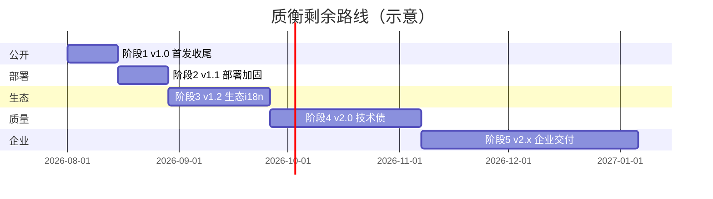

# 质衡（Qualitest）开源与工程路线图

> **唯一总文档**：按阶段排列**未完成**工作项（阶段编号已顺延，连续 1～5）。  
> 工作区：`qualitest-all`（`qualitest` · `qualitest-demo` · `qualitest-intellij-plugin`）  
> 远程：GitHub Org [`qualitest-hq`](https://github.com/qualitest-hq)（当前 Private）  
> 维护：实施前以最新代码为准；完成后在文末 checklist 勾选。

---

## 1. 现状与目标

| 目录 | 说明 |
| ---- | ---- |
| `qualitest/` | 主平台（后端 + `qualitest-ui/`）；Compose 全栈、Flyway、CI、社区文件已就绪 |
| `qualitest-demo/` | 接口靶场；独立 Compose；含 `/test-support` 快照还原样板 |
| `qualitest-intellij-plugin/` | IDEA 插件（项目级上传 + 分组过滤已落地） |
| `qualitest-all/` | 本地聚合工作区（无 Git） |

| 维度 | 目标 |
| ---- | ---- |
| **产品** | 「5 分钟跑起来」；测试流 / AI Diff / IDEA / MCP / 数据快照还原 |
| **技术** | 公开日 CI 绿、文档可搜；后续 GHCR / 插件市场 / 英文文档 / K8s |
| **Star** | v1.0 首发后首年 **500～800**；全阶段到位 **1500～3000** |

---

## 2. 已完成摘要（不再展开）

| 原编号（已归档） | 已交付 |
| ---------------- | ------ |
| **阶段 0** | 配置外置、工作区扫描、Apache 2.0、`.gitignore`、`application-docker.yml`；三仓从 0 单 commit |
| **阶段 1 大半** | Org + 三仓 Private、CI、Compose 全栈、社区文件、README、mcp、Topics、插件上传 |
| **原阶段 2** | 被测数据快照 / 还原重试（已交付，接入见 [test-support-starter](../../qualitest-demo/test-support-starter/README.md)） |
| **原阶段 3** | UI 入主仓、fixture 单一来源、CI 路径触发、`docs/deploy.md`、Issue/PR 模板 |
| **原阶段 4 前半** | Flyway（仅主仓）、双仓独立 Compose（demo 不接 Flyway） |

> 精简时删掉了已做完的原阶段 2 / 3，并把后续阶段**重新编号为 1～5**，避免「1 跳 4」。

**约定**：不发空 GitHub Release、不维护 CHANGELOG；变更以 git / README / `docs/` 为准。

---

## 3. 阶段总览（剩余）



| 阶段 | 版本 | 核心剩余 | Star |
| ---- | ---- | -------- | ---- |
| **1** | v1.0.0 | Public、GIF、首发文、分支保护 | **500～800 基础** |
| **2** | v1.1.0 | dev-deps、GHCR、CI docker、override 示例 | +50～150 |
| **3** | v1.2.0 | 插件市场、传播（英文文档已齐） | **+200～500** |
| **4** | v2.0.0 | 前端拆分、引擎加固、AI 安全 | 口碑 |
| **5** | v2.x | Helm/K8s、Dev Container 等 | 企业采信 |

---

## 4. 阶段 1：v1.0 公开首发（收尾）

**目标**：陌生人 15 分钟内 `docker compose up -d` 登录；首发文发出。

| ID | 任务 | 产出 | 估时 |
| -- | ---- | ---- | ---- |
| 1.1 | 三仓改 **Public** | `qualitest` / `qualitest-demo` / `qualitest-intellij-plugin` | 公开日 |
| 1.2 | `main` 分支保护 / required checks | **须 Public 之后再开**（Private + Free Org 不可用） | 0.5h |
| 1.3 | 3 个核心 GIF | `demo-api-console`、`demo-flow-canvas`、`demo-ai-diff` 或 `demo-mcp-cursor` | 1d |
| 1.4 | 首发实战文 | 掘金 / 知乎 / V2EX；草稿 [`docs/v1.0-首发文草稿.md`](./v1.0-首发文草稿.md) | 1d |

**公开日安全动作**（三仓改 Public 后立刻做）：

1. Dependabot + Secret scanning + Push protection（Settings → Code security）
2. 保护 `main` → Require status checks（如 `backend` / `frontend`）
3. README 标明生产须改默认口令与 `token.secret`

**公开前再抽查**：SQL 种子无真实手机 / 邮箱 / 生产数据。

### 验收标准

- [ ] 陌生人：clone → `docker compose up -d` → 登录主站
- [ ] 按 README 链到 demo，完成一次调试或跑通一条测试流
- [ ] 项目设置可见 MCP 配置说明
- [ ] `main` CI 绿；无明文生产口令
- [ ] GIF ≥ 2 张；README 链接为 `qualitest-hq`

### 首发后 30 天

| 指标 | 健康线 | 偏低时 |
| ---- | ------ | ------ |
| Star | 2 周 80+，1 月 200+ | 补第二篇「MCP + 测试流」 |
| Fork | Star 的 5%～15% | 查 Quick Start 卡点 |
| Issue | 有复现、有讨论 | 优先修部署文档 |

---

## 5. 阶段 2：v1.1 部署加固

Flyway 与双仓 Compose 已在此前交付；运维约定见 [`docs/deploy.md`](./deploy.md)。本阶段只做剩余工程化项。

| ID | 任务 | 产出 | 估时 |
| -- | ---- | ---- | ---- |
| 2.1 | ~~`scripts/dev-deps-up/down`~~ | **已完成**（`.sh` / `.bat`；见 `docs/deploy.md`「仅依赖」） | — |
| 2.2 | GHCR 镜像 | `ghcr.io/qualitest-hq/qualitest`；README / deploy 附 pull | 1～2d |
| 2.3 | CI：`docker build` 校验 | PR 只 build 不 push | 1d |
| 2.4 | `docker-compose.override.yml.example` | 本机改端口模板 | 0.5d |

**体验分档**：

| 档位 | 命令 | 状态 |
| ---- | ---- | ---- |
| A/B 依赖 / 全栈一键 | `docker compose up -d` | ✅ |
| C 开发热更 | `dev-deps-up` + 宿主机 `mvn` / `yarn dev` | ✅ |
| D 含靶场 | 另起 demo 仓 Compose | ✅ |
| E 生产 K8s | Helm `deploy/helm/qualitest` | ✅ 骨架（未实测） |

---

## 6. 阶段 3：v1.2 生态与国际化

| ID | 任务 | 产出 | 估时 |
| -- | ---- | ---- | ---- |
| 3.1 | **JetBrains 插件市场上架** | 审核通过；README 链到市场 | 3～7d |
| 3.2 | ~~**英文全文档**~~ | **已完成**：`README.en.md`；`docs/mcp.en.md` / `deploy.en.md` / `test-flow-nodes.en.md` / `project-summary.en.md` | — |
| 3.3 | 中文文档补全 | ~~节点 / 概念地图 / Staging / 占位符 / 素材 / FAQ~~ **已完成** | — |
| 3.4 | `docs/showcase.md` | 用户案例（征得同意） | 持续 |
| 3.5 | Awesome 列表 PR | `awesome-testing` 等 | 1d |
| 3.6 | 第二篇传播 | HN Show HN **或** 中文第二篇 | 1d |
| 3.7 | `CODE_OF_CONDUCT.md` | 有国际贡献者时 | 0.5d |

**累计 Star 预期（至阶段 3）**：首年 **800～1500**。

---

## 7. 阶段 4：v2.0 代码质量与稳定性

| ID | 任务 | 说明 | 估时 |
| -- | ---- | ---- | ---- |
| 4.1 | **前端上帝组件拆分** | `ApiDebugTab.vue` 等 → 子组件 + composable，单文件约 ≤500 行 | 2～3 周 |
| 4.2 | 测试流超时 / 熔断 | `flow.node.timeout`、`flow.run.timeout` | 3～5d |
| 4.3 | 子流循环引用 / 深度限制 | `SubflowNodeHandler` | 2～3d |
| 4.4 | 接口导入分批 | `ApiImportServiceImpl`；异步进度 | 2～3d |
| 4.5 | AI apiKey 加密与日志脱敏 | AES 落库；日志掩码；生产 `info` | 3～5d |
| 4.6 | 节点处理器 Spring 注入 | `Map<String, NodeHandler>` | 2d |
| 4.7 | 流程合并重构 + 补测 | `GraphMerger` 等 | 3～5d |
| 4.8 | 事务 / 索引 / 分页 | rollbackFor；`projectId`/`status` 索引 | 1 周 |
| 4.9 | AI 连接测试 + LLM 韧性 | 超时 + 重试 + 熔断 | 3～5d |
| 4.10 | 测试覆盖补强 | 后端关键路径；前端 e2e 可选 | 1～2 周 |
| 4.11 | （可选）画布独立快照节点 | 评估单独编排 checkpoint 节点 | 评估 |
| 4.12 | v2.0.0 收口 | BREAKING 写进 README / docs；不发 Release | — |

### 技术债优先级（待办）

| 优先级 | 项 | 阶段 |
| ------ | -- | ---- |
| 🔴 | AI 密钥加密与日志脱敏 | 4.5 |
| 🔴 | 测试流超时 / 子流环 | 4.2、4.3 |
| 🔴 | 接口导入分批 | 4.4 |
| 🟡 | 前端上帝组件 / 节点注入 / 合并 / 事务索引 / AI 韧性 | 4.1、4.6～4.9 |
| 🟢 | 测试覆盖 / MapStruct / K8s | 4.10、5 |

> 弱默认口令已外置（dev 可覆盖）；**生产须换强密钥**并关 Druid 或加白名单。

---

## 8. 阶段 5：v2.x 企业交付

| ID | 任务 | 产出 | 估时 |
| -- | ---- | ---- | ---- |
| 5.1 | ~~**Helm Chart / K8s**~~ | **已完成骨架**（`deploy/helm/qualitest`）；**未实测**，谁用谁验 | — |
| 5.2 | **Dev Container / Codespaces** | JDK + Node + Docker sock | 3～5d |
| 5.3 | 前端打进 JAR（可选） | 单容器 Compose | 3～5d |
| 5.4 | MapStruct 收敛 DTO | 持续 | 持续 |
| 5.5 | `docs/ROADMAP.md` | 公开 3～6 个月方向 | 0.5d |
| 5.6 | GitHub Discussions | 减轻 Issue 噪音 | 0.5d |
| 5.7 | Dependabot 常态化 | 每季度合并安全更新 | 持续 |
| 5.8 | 双远程策略 | GitHub 为主；Gitee 只读镜像 | — |

**全阶段 Star 预期**：首年 **1500～3000**（少长期运营）。

---

## 9. 社区与发布约定

**一句话优先级**：

```text
公开 + GIF + 首发文 > GHCR / dev-deps > 插件市场 > 英文全文档 > 技术债 > K8s
```

| 仓库 | 版本策略 |
| ---- | -------- |
| `qualitest` | 功能与 UI 同步 semver；`v2.0.0` 为大技术债版本；**不发 GitHub Release** |
| `qualitest-demo` | 可略滞后；已含 `/test-support`；**不发 GitHub Release** |
| `qualitest-intellij-plugin` | 独立 semver；IDE 大版本后 1～2 周跟进；**GitHub Release 附 ZIP**；`changeNotes` 在 Gradle；Marketplace 阶段 3.1 后 CI 自动发布 |

长期：Issue 分级；首发期后尽量 48h 内回复；每季度过 Dependabot。

---

## 10. 总 checklist（剩余）

### 阶段 1（v1.0.0）

- [ ] 1.1 三仓改为 **Public**
- [ ] 1.2 分支保护 / required checks（Public 后）
- [ ] 公开日：Dependabot + Secret scanning + Push protection
- [ ] 1.3 GIF（≥2）
- [ ] 1.4 首发文发出
- [ ] 验收标准全部通过

### 阶段 2（v1.1.0）

- [x] 2.1 dev-deps 脚本（`scripts/dev-deps-up|down` .sh/.bat）
- [ ] 2.2 GHCR
- [ ] 2.3 CI docker build
- [ ] 2.4 override 示例

### 阶段 3（v1.2.0）

- [ ] 3.1 插件市场上架
- [x] 3.2 英文全文档（`README.en.md` + mcp / deploy / test-flow-nodes / project-summary / ai-staging / flow-variables-and-values / assets / faq `.en.md`）
- [x] 3.3′ 中文产品文档（节点、概念地图、Staging、跑流变量与测值、素材、FAQ）
- [ ] 3.4～3.7 showcase、Awesome、第二篇、CoC

### 阶段 4（v2.0.0）

- [ ] 4.1～4.10 技术债
- [ ] 4.11 画布快照节点（评估）
- [ ] 4.12 版本收口

### 阶段 5（v2.x）

- [x] 5.1 Helm / K8s（`deploy/helm/qualitest` 骨架；社区自测）
- [ ] 5.2 Dev Container
- [ ] 5.3～5.8 可选项

---

## 附录

### A. 生态导航

| 仓库 | 端口 |
| ---- | ---- |
| [qualitest](https://github.com/qualitest-hq/qualitest) | Compose Web **80**；本机 API **8080** / UI **5173** |
| [qualitest-demo](https://github.com/qualitest-hq/qualitest-demo) | API **8081**；Compose UI **8082** |
| [qualitest-intellij-plugin](https://github.com/qualitest-hq/qualitest-intellij-plugin) | — |

### B. 文档索引

| 文档 | 作用 |
| ---- | ---- |
| [`docs/全面测试手册.md`](./全面测试手册.md) | 系统化验收：Cursor 自动测（T1/T2/T3） |
| [`docs/v1.0-首发文草稿.md`](./v1.0-首发文草稿.md) | 首发文草稿 |
| [`docs/deploy.md`](./deploy.md) / [`.en.md`](./deploy.en.md) | 部署、生产加固、Flyway |
| [`docs/mcp.md`](./mcp.md) / [`.en.md`](./mcp.en.md) | Cursor MCP |
| [`docs/project-summary.md`](./project-summary.md) / [`.en.md`](./project-summary.en.md) | 产品概念地图（鉴权 / 主链路） |
| [`docs/ai-staging.md`](./ai-staging.md) / [`.en.md`](./ai-staging.en.md) | AI Staging / Diff |
| [`docs/flow-variables-and-values.md`](./flow-variables-and-values.md) / [`.en.md`](./flow-variables-and-values.en.md) | 跑流变量与 HTTP 测值 |
| [`docs/assets.md`](./assets.md) / [`.en.md`](./assets.en.md) | 素材库 |
| [`docs/faq.md`](./faq.md) / [`.en.md`](./faq.en.md) | FAQ |
| [`docs/test-flow-nodes.md`](./test-flow-nodes.md) / [`.en.md`](./test-flow-nodes.en.md) | 测试流节点 |
| [`README.en.md`](../README.en.md) | 英文 README |
| `qualitest-demo/docs/ai-test-flow-prompts.md` | AI + 靶场闭环 |
| `qualitest-demo/test-support-starter/README.md` | 快照 / 还原接入 |

### C. 参考

- [JetBrains Plugin 发布](https://plugins.jetbrains.com/docs/intellij/publishing-plugin.html)
- [Dependabot](https://docs.github.com/en/code-security/dependabot) · [Secret scanning](https://docs.github.com/en/code-security/secret-scanning)

---

*文档版本：2026-07-31 · 剩余阶段已重排为连续 1～5*
