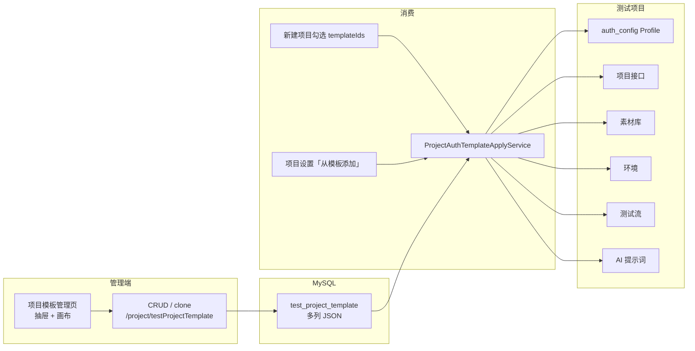
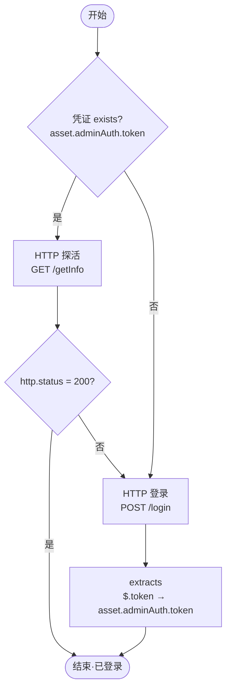
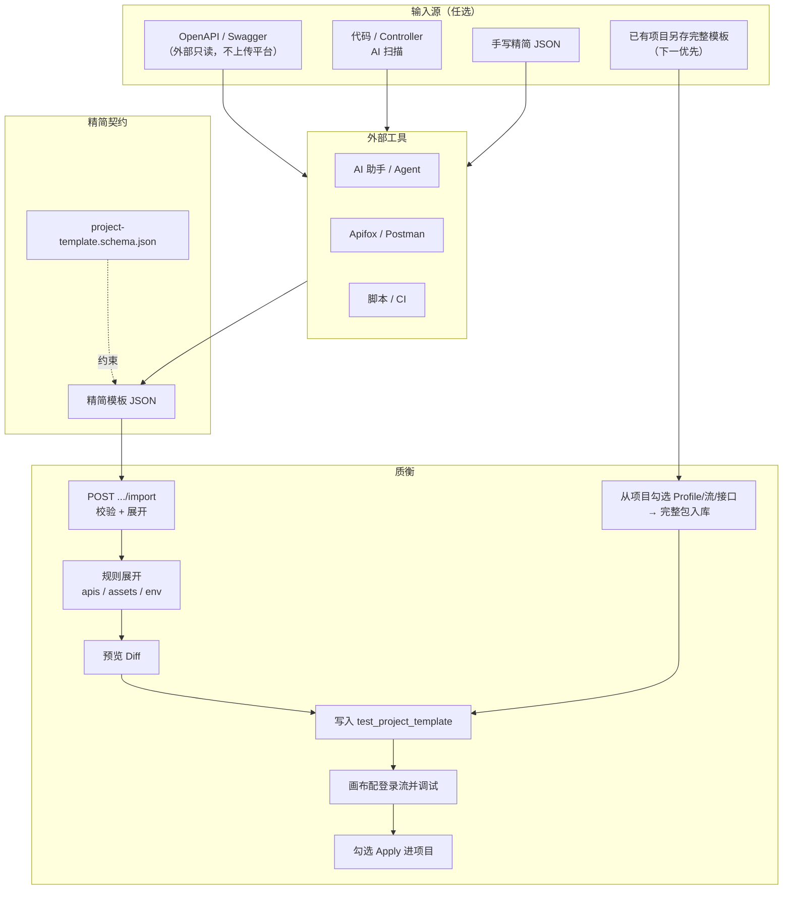
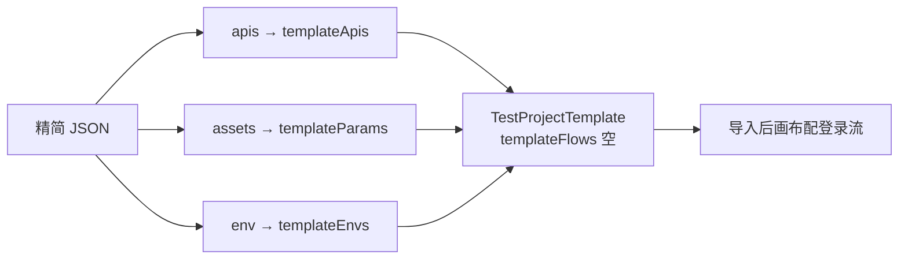
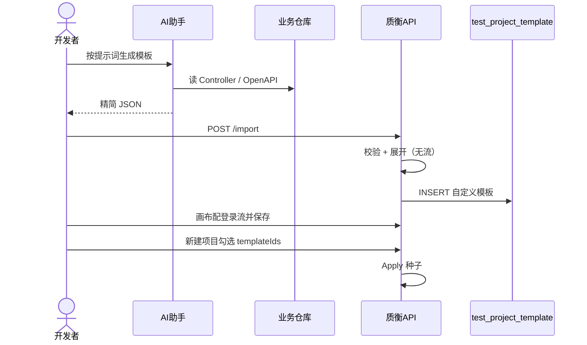

# 项目模板快速配置方案

> 目标：把「项目模板」从重手操表单，变成 **精简 JSON → 一键导入 →（可选）画布配登录流** 的流水线，让各类 AI 助手 / Apifox / 脚本等工具能直接参与配置。  
> 状态：契约已冻结于 `docs/project-template/`；import/export 按阶段 1 落地；「从项目另存完整模板」已落地（项目设置入口）。  
> 相关能力：表 `test_project_template`、管理页 `/project/testProjectTemplate`、勾选 Apply、`designMode=template` 画布 AI。

---

## 1. 背景与问题

### 1.1 项目模板是什么

项目模板是一套**可勾选进测试项目的鉴权 / 预制资产包**。一行模板对应一套 Profile，勾选后由 `ProjectAuthTemplateApplyService` 种子到项目：

| 内容 | 是否必须 | 种子结果 |
|:-----|:---------|:---------|
| 预制接口 `templateApis` | 是 | 鉴权 Profile + 项目接口（method+path 去重） |
| 预制参数 `templateParams` | 否 | 主路径素材库（asset）；口令等 |
| 预制环境 `templateEnvs` | 否 | 填占位 envUrl、合并环境变量 |
| 预制测试流 `templateFlows` | 否（鉴权实践几乎必备） | 测试流；`extracts` 派生凭证与托管头 |
| 预制 AI 提示词 `templatePrompts` | 否 | 项目级 AI 快捷提示词 |
| 托管请求头 | **不存模板表** | Apply 时从登录流 `extracts` 生成 |

内置样例（只读，可克隆）：`RuoYi Bearer`、`RuoYi Session`、`客户端 Bearer`、`管理端 Bearer`。

### 1.2 当前手操痛点

```text
打开「项目模板」→ 填名称 / pathPrefix
    → 逐条编预制接口（method/path/schema/auth/designHints…）
    → 编素材口令（asset）
    → 编环境
    → 打开全屏画布配登录流（探活 → 登录 → extracts）
    → 回抽屉确认 → 保存
    → 新建项目时勾选模板
```

痛点归纳：

1. **字段极重**：单接口接近项目接口设计页全量字段，鉴权相关只需其中一小撮。
2. **跨段依赖强**：流 HTTP 节点要绑模板合成 id；`extracts` 的 scope / entryKey / expr 决定托管头；body 里 `{{asset.*}}` 必须对齐素材名。
3. **双通道 UI**：抽屉草稿 + 全屏画布，易丢改、难批量。
4. **无导入导出**：只能 CRUD + 克隆；不能从 OpenAPI / 代码扫描 / 外部 JSON 灌进模板表。
5. **AI 覆盖不全**：模板画布已有 AI 改流（`designMode=template`），但**没有**「生成整包模板」入口。

### 1.3 设计原则（结论先行）

| 原则 | 说明 |
|:-----|:-----|
| 结构映射用规则 | OpenAPI / 精简 JSON → `templateApis` / asset / env 用确定性转换 |
| 模糊决策才用 AI | token JSONPath、是否要探活、Session Cookie 名等交给 AI 或人确认 |
| 对外精简、对内完整 | 开发者只碰「精简 Schema」；落库前由质衡展开成现有内部 JSON |
| 模板是 Profile 种子包 | 只收登录 / 探活 / 验证码等鉴权相关口，**不要**塞全量业务 API |

---

## 2. 现状架构（简图）

### 2.1 数据与消费链路



### 2.2 登录流骨架（内置约定）

前端 `buildLoginGraphJson` 已固化「探活再登录」拓扑，可作为规则合成的样板：



Apply 时：根据 `extracts` 生成 Credential 规则与托管头（如 `Authorization: Bearer {{asset.adminAuth.token}}`），模板表本身不存头。

### 2.3 已有能力 vs 缺口

```text
已有
├── 模板表 JSON 存储 + Apply 种子
├── 克隆内置 → 自定义
├── 模板画布 AI 改流（designMode=template）
├── 项目级接口导入（IDEA 插件 / ApiImport）—— 目标是项目，不是模板
└── 平台子流模板（另一概念，classpath JSON）

缺口（本方案要补）
├── 模板级 import / export                         ← 阶段 1 已落地
├── 对外精简 Schema + 校验                         ← 已落地
├── 导入后画布配登录流（不在 import 合成流）         ← 人工冒烟待验
└── 从已跑通项目另存为完整模板（可含登录流）         ← 已落地（项目设置）
```

---

## 3. 目标方案总览

### 3.1 推荐主链路（两段式）



**两条路径**：

1. **冷启动（slim）**：人或外部 AI 产出精简 JSON → import 展开（无流）→ 画布配登录流并调试。  
2. **从项目另存（推荐下一做）**：项目鉴权已跑通 → 勾选 Profile / 登录流 / 相关接口 → **完整包**写入模板表（可含流）→ 新项目勾选 Apply。不做「先压成精简 JSON 再导入」的弯路。

### 3.2 与「初始化 API + AI 生成模板」原设想对照

| 原设想 | 建议调整 | 原因 |
|:-------|:---------|:-----|
| 提供 JSON API 模板 | ✅ 做「精简 Schema」 | 完整内部字段对人和模型都不友好 |
| AI 生成「初始化 API」 | ⚠️ 改成生成**模板 JSON** | 中间多一层 REST 定义，难校验、易重复 |
| 再用初始化 API 让质衡 AI 生成模板 | ⚠️ 改成 **import 落库** + **画布配流**；或 **从项目另存完整模板** | 结构映射确定性更高；另存可带走已调试的流 |

若后续要做自动化流水线（CI），用管理端 Token 调现有 `POST .../import` 即可，**不必**先发明一套「初始化业务 API」。

### 3.3 用户体验对比

```text
【现在】
人手填抽屉 × N 接口 + 画布配流          ≈ 30～90 分钟 / 套（陌生框架更久）

【目标·冷启动 slim】
外部 AI 出精简 JSON → 导入 → 画布配流 → 勾选
                                        ≈ 5～20 分钟 / 套

【目标·从项目另存完整模板（优先增强）】
项目里已调通登录流
  → 「另存为项目模板」勾选 Profile / 流 / 鉴权口 / 素材
  → 完整包入库（含已调试 extracts）
  → 新项目勾选即可
                                        ≈ 1～5 分钟 / 套（前提是项目已跑通）
```

---

## 4. 导入导出格式

权威交付物见 [`docs/project-template/`](./project-template/)。

**两种形态，导入自动识别：**

| 形态 | 识别 | 用途 |
|:-----|:-----|:-----|
| **完整包** | 含 `templateApis` | 备份/迁移/往返；与库内字段同形，**可含** `templateFlows` |
| **精简包（slim）** | 含 `apis`、无 `templateApis` | AI 冷启动；展开后无流，再在画布配流 |

导出**只出完整包**（有啥导啥）。`formatVersion` 可选，缺省视为 `1`；过大则拒绝。

完整包字段示例见 [`examples/full-pack.example.json`](./project-template/examples/full-pack.example.json)。

### 4.1 精简包设计要点（冷启动）

- **只描述意图**：鉴权风格、登录/探活口、素材、环境、pathPrefix、credential 提示。
- **无 `role`**：API 写清请求与响应样例；精简导入**不生成**预制测试流（导入后画布配置）。
- **不要求**手写 `graphJson`、完整 `requestConfig` 树（由展开器补齐）。

### 4.2 精简示例（Bearer）

与 `docs/project-template/examples/bearer-ruoyi.slim.json` 一致：

```json
{
  "templateName": "Demo Bearer",
  "authStyle": "bearer",
  "pathPrefix": ["/api/"],
  "credential": {
    "asset": "adminAuth",
    "extract": "$.token"
  },
  "assets": {
    "adminAuth": {
      "username": "admin",
      "password": "admin123"
    }
  },
  "env": {
    "envUrl": "http://127.0.0.1:8800",
    "variables": {
      "clientId": "demo"
    }
  },
  "apis": [
    {
      "name": "登录",
      "method": "POST",
      "path": "/login",
      "authMode": "none",
      "bodyMode": "json",
      "headers": {
        "Content-Type": "application/json"
      },
      "body": {
        "username": "{{asset.adminAuth.username}}",
        "password": "{{asset.adminAuth.password}}"
      },
      "response": {
        "code": 200,
        "msg": "操作成功",
        "token": "eyJhbGciOi..."
      }
    },
    {
      "name": "获取用户信息",
      "method": "GET",
      "path": "/getInfo",
      "authMode": "inherit",
      "response": {
        "code": 200,
        "user": {},
        "roles": []
      }
    }
  ]
}
```

### 4.3 字段说明

| 字段 | 类型 | 必填 | 说明 |
|:-----|:-----|:----:|:-----|
| `templateName` | string | 是 | 落库后作 Profile 名；未删范围内唯一 |
| `authStyle` | enum | 是 | `bearer` / `session` / `header` / `none` / `custom`（提示用，不触发生成流） |
| `pathPrefix` | string[] | 否 | → `matchConfig.pathPrefix`；禁止单独 `/` |
| `credential` | object | 否 | 画布/人提示：`asset`、`extract`、`tokenField`、`cookieName`、`headerName`… |
| `assets` | object | 否 | map → `templateParams`（kind=asset） |
| `env` / `envs` | object/array | 否 | → `templateEnvs`；`variables` 为简易 map |
| `apis` | array | 是 | 至少 1 条；见下 |
| `flows` | — | 否 | 精简包**不接受**；传入则 warning 并忽略 |
| `_uncertain` | string[] | 否 | validate → warnings，不阻断 |
| `remark` / `enableStatus` / `sortNum` | — | 否 | 有则透传 |

完整包另用 `templateApis` / `templateParams` / `templateEnvs` / `templateFlows` / `templatePrompts`（与表列同形）；`templateFlows` 可 `[]`。

`apis[]`：`name` / `method` / `path` 必填；`authMode`、`bodyMode`（默认 json）、`headers`、`query`、`body`、`response`；默认 `syncProtected=true`。

### 4.4 Session / header 片段

```json
{
  "authStyle": "session",
  "credential": {
    "asset": "adminAuth",
    "cookieName": "Admin-Token",
    "extract": { "from": "header", "expr": "Set-Cookie" }
  }
}
```

### 4.5 展开映射（精简 → 内部）



---

## 5. 质衡侧 API

在现有 `/project/testProjectTemplate` 上扩展，不破坏 CRUD。

| 方法 | 路径 | 说明 |
|:-----|:-----|:-----|
| `GET` | `/project/testProjectTemplate/schema` | 精简 Schema（冷启动） |
| `GET` | `/project/testProjectTemplate/aiPrompt` | 精简生成提示词（管理页「复制提示词」） |
| `POST` | `/project/testProjectTemplate/validate` | 校验完整包或精简包，不写库 |
| `POST` | `/project/testProjectTemplate/import` | 双形态导入；可选 `dryRun` |
| `GET` | `/project/testProjectTemplate/{id}/export` | 导出**完整包** |
| `POST` | `/project/testProject/{id}/saveAsAuthTemplate` | 从项目另存完整鉴权模板（流关联必带） |

### 5.1 import 请求

```http
POST /project/testProjectTemplate/import
Content-Type: application/json

{
  "dryRun": false,
  "overwriteByName": false,
  "template": { }
}
```

响应含：`testProjectTemplateId`（非 dryRun）、`kind`（full/slim）、`expandedSummary`、`warnings`、`preview`。

### 5.2 权限

- import / validate / schema / aiPrompt / saveAsAuthTemplate：`project:testProjectTemplate:add`
- export：`project:testProjectTemplate:query`
- import 只创建 `builtinStatus=0`

---

## 6. 外部工具怎么用

### 6.1 仓库侧交付物

```text
docs/project-template/
  project-template.schema.json   # 精简冷启动 Schema
  examples/bearer-ruoyi.slim.json
  examples/session-ruoyi.slim.json
  examples/full-pack.example.json
```

运行时提示词（管理端「复制提示词」）：`qualitest-system/src/main/resources/project-template/AI_PROMPT.md`

### 6.2 生成提示词

**管理页（推荐）**：项目模板 → 导入 → **复制提示词** → 贴到任意 AI 助手。  
也可直接打开上述 `AI_PROMPT.md`，复制「---」以下整段。

提示词要求先枚举仓库内全部鉴权端；**多端时按端各生成一份**精简 JSON（`---` 分隔，各自导入），避免只出管理端 `/login` 样板。

### 6.3 导入方式

**管理页（主）**：项目模板 → 导入 → 粘贴完整包或精简 JSON → 预览 → 保存。导出为 `*.template.json` 完整包。

**HTTP（辅）**：同一套 `POST .../import`（可先 validate / dryRun）。

### 6.4 端到端时序



---

## 7. AI 在方案中的定位

### 7.1 该做什么 / 不该做什么

```text
适合 AI
├── 从代码/OpenAPI 推断 login/probe 路径与 method
├── 猜测 token JSONPath / Cookie 名（标不确定项）
├── 在已有模板画布上 patch 登录流（已有能力）
└── 根据一次失败 Run 纠偏 extracts（可复用 LoginExtractSuggestor 思路）

不适合 AI（应用规则）
├── 把精简字段展开成 requestConfig 树
├── Apply 幂等与去重
└── 权限与 builtin 只读约束
```

### 7.2 产品入口建议

| 入口 | 行为 |
|:-----|:-----|
| 模板画布 AI（已有） | `designMode=template`，改 `graphJson` Staging |
| **从项目另存完整模板**（已落地） | 项目设置勾选 Profile + 流；流关联接口/素材必带；可追加 → 写完整包 |
| 精简 JSON 导入（已有） | 冷启动；无流，导入后再画布配 |

### 7.3 与现有 MCP 的关系

- 当前项目 MCP：**只读**勘察接口/流/Run（见 [mcp.md](./mcp.md)）；**不**承担模板写库。  
- 模板快速配置：管理端 **HTTP** `validate` / `import` / `export`（权限与项目 Token 隔离）。

---

## 8. 落地分期

### 阶段 0 — 契约与样例（0.5～1 人日）

- 冻结 `$schemaVersion: 1` 字段表  
- 提供 `bearer` / `session` 各 1 份精简样例（对齐内置 RuoYi）  
- 文档化 Cursor 提示词  

**验收**：人工按样例能理解如何填写；用内置模板「心智模型」对得上。

### 阶段 1 — validate + import + export（核心，已落地）

- 后端：精简 JSON → 内部 `TestProjectTemplate` 展开器  
- `validate` / `import` / `export` / `schema` 接口  
- 前端：导入对话框 + 预览 warnings + 导出按钮  

**验收**：

1. 导入 Bearer 精简样例 → 列表出现自定义模板  
2. 勾选进空项目 → 有登录接口、素材、登录流、派生 Bearer 头  
3. export 再 import（或 dryRun）不丢关键语义  

### 阶段 2 — 从项目另存完整模板（已落地）

- 项目设置「另存为项目模板」  
- 勾选：Auth Profile、登录测试流；流关联接口/素材必带；可追加 Profile 其余口 / 素材 / 首环境 / 提示词  
- 规则打包为**完整包**写入 `test_project_template`（可含已调试 `templateFlows`）  
- API：`POST /project/testProject/{id}/saveAsAuthTemplate`  

**验收**：跑通登录的项目 → 勾几项另存模板 → 新空项目勾选 Apply → 登录流与托管头可用。

### 阶段 3 —（按需）规则/体验加固

- 另存时的勾选默认值与警告（漏登录流、多 Profile）  
- slim 导入路径的 warnings 文案与引导进画布  
---

## 9. 风险与约束

| 风险 | 缓解 |
|:-----|:-----|
| 精简 → 内部 **lossy**（无流） | 冷启动后再画布配流；往返用完整包导出 |
| AI 猜错 token 路径 | warnings + `_uncertain`；预览必过 |
| 把全量业务 API 塞进模板 | Schema / 提示词 / import 校验限制 apis 数量；模板只收鉴权相关口 |
| 运行库 schema 与代码不一致 | 落地前核对 `template_*` 列是否已迁移 |
| Apply 同名 Profile 整份跳过 | 导入用新 `templateName`；或文档说明先改名再勾选 |
| 写库权限 | 走管理端 `project:testProjectTemplate:*`；与项目只读 MCP Token 分离 |

### 非目标（本方案明确不做）

- 用项目模板替代「项目接口库」全量管理  
- 让 AI 无预览直接改内置模板  
- 为「生成模板」单独再造一套与 Apply 无关的运行时  
- IDEA 插件「导出为项目模板」（插件只做业务 API 上传；另存完整模板走质衡 Web）  
- 管理向 MCP 写模板（写库只用管理端 HTTP import）  
- OpenAPI / Swagger **文件直接上传**（属项目接口库 / ApiImport 轨道，与模板冷启动无关；外部工具可读 OpenAPI 再产出精简 JSON）  
- 导入预览「AI 完善鉴权」（有另存完整模板 + 模板画布 AI 后收益低，不做）  
- **从项目反推精简 JSON**（多此一举；另存直接出完整包即可）  

---

## 10. 实施检查清单（开发用）

- [x] 完整包 Codec + 双形态 import/export（含 flows）
- [x] `project-template.schema.json` + 精简样例 + resources 内 `AI_PROMPT.md` + full-pack 样例
- [x] 展开器：apis / assets / envs（精简冷启动；**不**合成 flows）
- [x] `validate` / `import` / `export` / `schema` Controller + 权限
- [x] 前端导入预览 UI + 完整包导出
- [x] Bearer / Session / 完整包 round-trip 单测
- [ ] 导入后画布配流再勾选 Apply（精简路径人工冒烟）
- [x] 从已有项目另存 → 完整包模板（项目设置；流关联必带）

---

## 11. 附录

### 11.1 现有相关代码（便于实现时跳转）

| 区域 | 路径 |
|:-----|:-----|
| 完整包 / 精简展开与导入 | `qualitest-system/.../support/templatepack/` |
| 从项目另存 | `.../templatepack/ProjectTemplateFromProjectService.java` · `POST .../testProject/{id}/saveAsAuthTemplate` |
| 领域模型 | `qualitest-system/.../project/domain/TestProjectTemplate.java` |
| CRUD | `qualitest-admin/.../TestProjectTemplateController.java` |
| Apply | `qualitest-system/.../support/ProjectAuthTemplateApplyService.java` |
| 流合成参考 | `qualitest-ui/.../testProjectTemplate/utils/templateForm.js`（`buildLoginGraphJson`） |
| 管理页 | `qualitest-ui/.../views/project/testProjectTemplate/` |
| 表结构 / 内置种子 | `sql/qualitest_*.sql` → `test_project_template` |

### 11.2 术语

| 术语 | 含义 |
|:-----|:-----|
| 精简 JSON / slim | 冷启动契约，给人与 AI 写 |
| 完整包 / full pack | 与库内同形，导出默认；可含 flows |
| 展开 / expand | slim → 内部 `template_*`（不含自动造流） |
| Apply | 勾选模板后种子到具体测试项目 |
| authStyle | 精简包鉴权风格提示 |
| formatVersion | 完整包可选版本，缺省 1 |
| extracts | 测试流 HTTP 节点抽取规则，决定凭证与托管头 |

### 11.3 一页纸决策摘要

```text
问题：项目模板手配成本高、往返要完整
决策：导出完整包；导入识别完整包或精简冷启动；formatVersion 可选
不做：让 AI 吐 graphJson；不为精简包强制版本号
验收：导出含 flows → 再导入齐全；slim 仍可导入
```

---

*文档版本：2026-09-04 · 质衡 qualitest*
