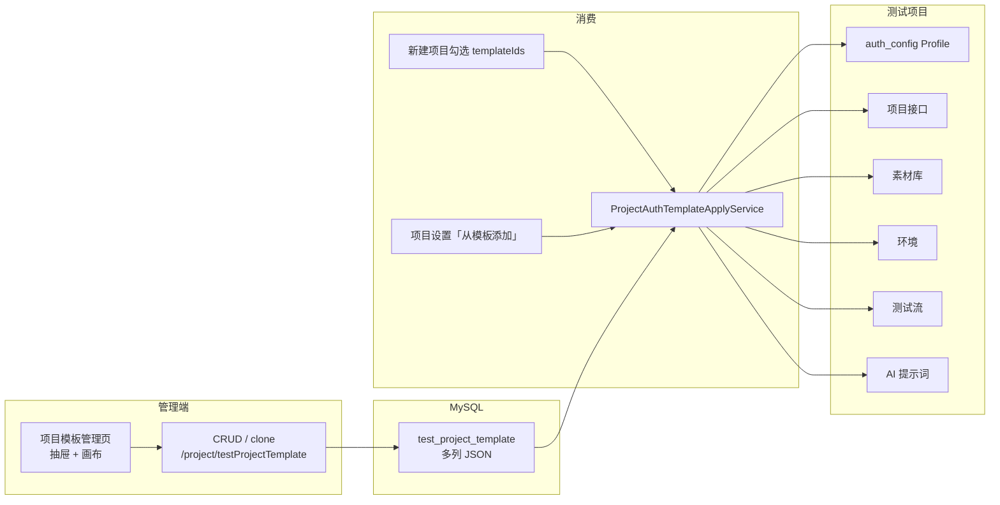
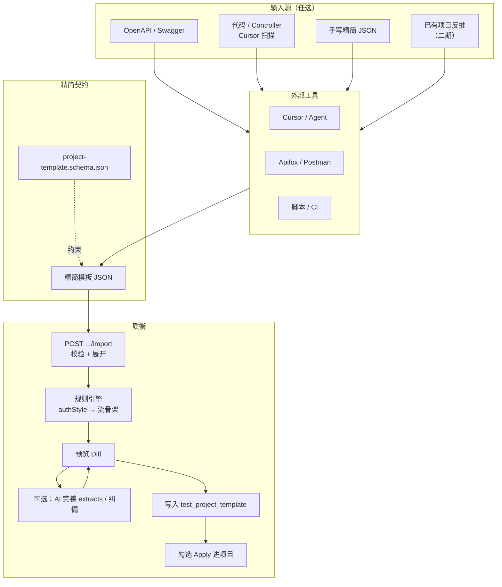
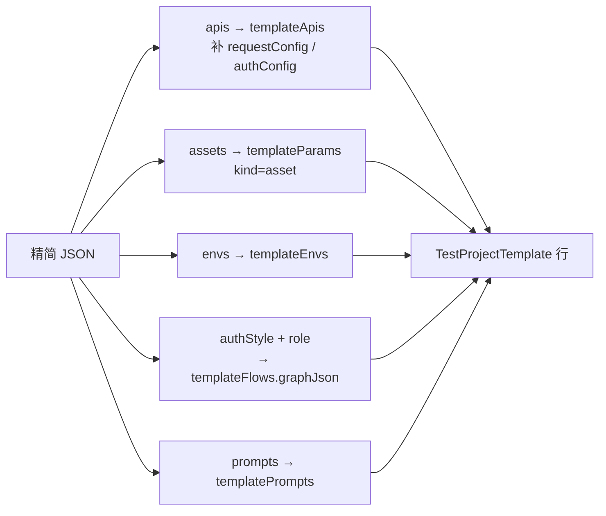
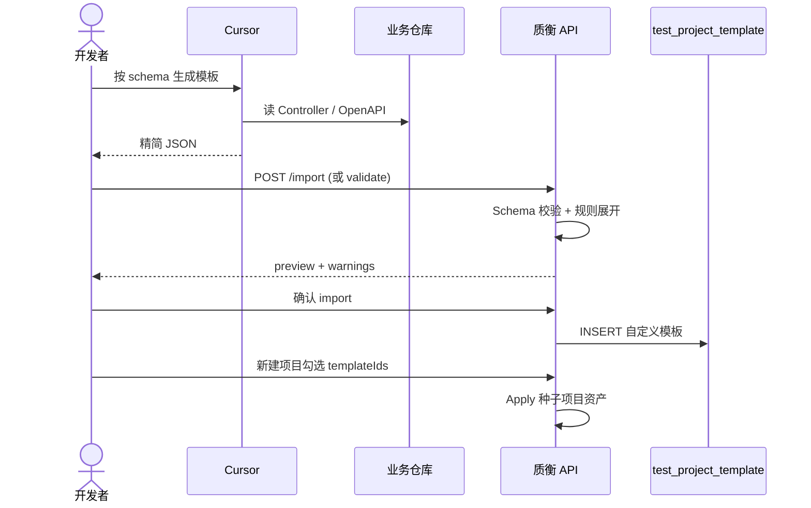

# 项目模板快速配置方案

> 目标：把「项目模板」从重手操表单，变成 **精简 JSON → 一键导入 →（可选）AI 补全鉴权流** 的流水线，让 Cursor / Apifox / 脚本等工具能直接参与配置。  
> 状态：方案文档（尚未实现 import/export；文中 API / Schema 为拟定设计）。  
> 相关能力：表 `test_project_template`、管理页 `/project/testProjectTemplate`、勾选 Apply、`designMode=template` 画布 AI。

---

## 1. 背景与问题

### 1.1 项目模板是什么

项目模板是一套**可勾选进测试项目的鉴权 / 预制资产包**。一行模板对应一套 Profile，勾选后由 `ProjectAuthTemplateApplyService` 种子到项目：

| 内容 | 是否必须 | 种子结果 |
|:-----|:---------|:---------|
| 预制接口 `templateApis` | 是 | 鉴权 Profile + 项目接口（method+path 去重） |
| 预制参数 `templateParams` | 否 | 主路径素材库（asset）；口令等 |
| 预制环境 `templateEnvs` | 否 | 填占位 envUrl、合并环境变量 |
| 预制测试流 `templateFlows` | 否（鉴权实践几乎必备） | 测试流；`extracts` 派生凭证与托管头 |
| 预制 AI 提示词 `templatePrompts` | 否 | 项目级 AI 快捷提示词 |
| 托管请求头 | **不存模板表** | Apply 时从登录流 `extracts` 生成 |

内置样例（只读，可克隆）：`RuoYi Bearer`、`RuoYi Session`、`客户端 Bearer`、`管理端 Bearer`。

### 1.2 当前手操痛点

```text
打开「项目模板」→ 填名称 / pathPrefix
    → 逐条编预制接口（method/path/schema/auth/designHints…）
    → 编素材口令（asset）
    → 编环境
    → 打开全屏画布配登录流（探活 → 登录 → extracts）
    → 回抽屉确认 → 保存
    → 新建项目时勾选模板
```

痛点归纳：

1. **字段极重**：单接口接近项目接口设计页全量字段，鉴权相关只需其中一小撮。
2. **跨段依赖强**：流 HTTP 节点要绑模板合成 id；`extracts` 的 scope / entryKey / expr 决定托管头；body 里 `{{asset.*}}` 必须对齐素材名。
3. **双通道 UI**：抽屉草稿 + 全屏画布，易丢改、难批量。
4. **无导入导出**：只能 CRUD + 克隆；不能从 OpenAPI / 代码扫描 / 外部 JSON 灌进模板表。
5. **AI 覆盖不全**：模板画布已有 AI 改流（`designMode=template`），但**没有**「生成整包模板」入口。

### 1.3 设计原则（结论先行）

| 原则 | 说明 |
|:-----|:-----|
| 结构映射用规则 | OpenAPI / 精简 JSON → `templateApis` / asset / env 用确定性转换 |
| 模糊决策才用 AI | token JSONPath、是否要探活、Session Cookie 名等交给 AI 或人确认 |
| 对外精简、对内完整 | 开发者只碰「精简 Schema」；落库前由质衡展开成现有内部 JSON |
| 模板是 Profile 种子包 | 只收登录 / 探活 / 验证码等鉴权相关口，**不要**塞全量业务 API |

---

## 2. 现状架构（简图）

### 2.1 数据与消费链路



### 2.2 登录流骨架（内置约定）

前端 `buildLoginGraphJson` 已固化「探活再登录」拓扑，可作为规则合成的样板：


Apply 时：根据 `extracts` 生成 Credential 规则与托管头（如 `Authorization: Bearer {{asset.adminAuth.token}}`），模板表本身不存头。

### 2.3 已有能力 vs 缺口

```text
已有
├── 模板表 JSON 存储 + Apply 种子
├── 克隆内置 → 自定义
├── 模板画布 AI 改流（designMode=template）
├── 项目级接口导入（IDEA 插件 / ApiImport）—— 目标是项目，不是模板
└── 平台子流模板（另一概念，classpath JSON）

缺口（本方案要补）
├── 模板级 import / export
├── 对外精简 Schema + 校验
├── authStyle → 登录流规则合成
├── 「AI 完善鉴权」产品入口
└──（可选）从已跑通项目反推模板
```

---

## 3. 目标方案总览

### 3.1 推荐主链路（两段式）



**一句话**：开发者（或 Cursor）只产出**精简 JSON**；质衡用规则展开成完整内部结构；AI 只负责补全 / 纠偏，不从零吐整包。

### 3.2 与「初始化 API + AI 生成模板」原设想对照

| 原设想 | 建议调整 | 原因 |
|:-------|:---------|:-----|
| 提供 JSON API 模板 | ✅ 做「精简 Schema」 | 完整内部字段对人和模型都不友好 |
| Cursor 生成「初始化 API」 | ⚠️ 改成生成**模板 JSON** | 中间多一层 REST 定义，难校验、易重复 |
| 再用初始化 API 让质衡 AI 生成模板 | ⚠️ 改成 **import 落库** + **可选 AI 补流** | 结构映射确定性更高；现有 AI 只擅改流 |

若后续要做自动化流水线（CI / MCP 写库），再把「精简 JSON」接到 MCP tool / 管理端 Token 即可，**不必**先发明一套「初始化业务 API」。

### 3.3 用户体验对比

```text
【现在】
人手填抽屉 × N 接口 + 画布配流          ≈ 30～90 分钟 / 套（陌生框架更久）

【目标·最小路径】
Cursor：「按 schema 从本仓库抽出登录/探活」 
  → 得到 slim JSON 
  → 管理页「导入」或 curl POST /import 
  → 预览通过 → 保存 
  → 新建项目勾选
                                        ≈ 5～15 分钟 / 套

【目标·AI 纠偏路径】
导入后探活/token 路径不对 
  → 「AI 完善鉴权」或打开模板画布 AI 
  → 确认 extracts / 探活条件 
  → 保存
```

---

## 4. 精简 JSON Schema（拟定）

### 4.1 设计要点

- **只描述意图**：鉴权风格、登录/探活口、素材占位、环境、pathPrefix。
- **role 标注**：`login` / `probe` / `captcha` / `other`，供规则绑流。
- **不要求**开发者手写 `graphJson`、`testProjectApiId`、完整 `requestConfig` 树（由展开器生成；需要时允许 `advanced` 覆盖）。
- **版本字段** `$schemaVersion`，便于以后演进。

### 4.2 完整示例（Bearer）

```json
{
  "$schemaVersion": 1,
  "templateName": "Demo Bearer",
  "remark": "示例：账号密码登录 + Bearer token",
  "enableStatus": 1,
  "sortNum": 100,
  "matchConfig": {
    "pathPrefix": ["/api/"]
  },
  "authStyle": "bearer",
  "credential": {
    "assetEntry": "adminAuth",
    "tokenField": "token",
    "headerName": "Authorization",
    "headerValueTemplate": "Bearer {{asset.adminAuth.token}}",
    "extract": {
      "from": "body",
      "expr": "$.token"
    }
  },
  "assets": [
    {
      "entryKey": "adminAuth",
      "fields": {
        "username": "admin",
        "password": "admin123"
      }
    }
  ],
  "envs": [
    {
      "envName": "local",
      "envUrl": "http://127.0.0.1:8080",
      "envVariables": {}
    }
  ],
  "apis": [
    {
      "role": "login",
      "apiName": "登录",
      "method": "POST",
      "path": "/login",
      "apiGroup": "系统.登录",
      "authMode": "none",
      "syncProtected": true,
      "body": {
        "username": "{{asset.adminAuth.username}}",
        "password": "{{asset.adminAuth.password}}"
      },
      "responseHints": {
        "tokenPath": "$.token",
        "successHttpStatus": 200
      },
      "designHints": ["token 在 $.token，不要写成 $.data.token"]
    },
    {
      "role": "probe",
      "apiName": "获取用户信息",
      "method": "GET",
      "path": "/getInfo",
      "apiGroup": "系统.登录",
      "authMode": "inherit"
    }
  ],
  "flow": {
    "enabled": true,
    "flowName": "登录",
    "probeThenLogin": true
  },
  "prompts": []
}
```

### 4.3 字段说明

#### 顶层

| 字段 | 类型 | 必填 | 说明 |
|:-----|:-----|:----:|:-----|
| `$schemaVersion` | number | 是 | 精简契约版本，当前为 `1` |
| `templateName` | string | 是 | 落库后作 Profile 名；未删范围内唯一 |
| `remark` | string | 否 | 备注 |
| `enableStatus` | 0/1 | 否 | 默认 1 |
| `sortNum` | number | 否 | 列表排序 |
| `matchConfig.pathPrefix` | string[] | 否 | 路径前缀匹配；禁止单独 `/` |
| `authStyle` | enum | 是 | 见下表 |
| `credential` | object | 条件 | `bearer` / `header` 等需要 |
| `assets` | array | 否 | 素材入口 |
| `envs` | array | 否 | 环境 |
| `apis` | array | 是 | 至少 1 条；建议含 `login` |
| `flow` | object | 否 | 默认按 authStyle 合成；`enabled:false` 则不生成流 |
| `prompts` | array | 否 | 预制 AI 提示词 |
| `advanced` | object | 否 | 逃生舱：直接贴内部 JSON 片段（慎用） |

#### `authStyle`

| 值 | 含义 | 规则合成要点 |
|:---|:-----|:-------------|
| `bearer` | Authorization Bearer | 默认探活→登录；extract → `asset.{entry}.token`；头 `Bearer {{...}}` |
| `session` | Cookie / Session | 登录后抽 Cookie 或 Set-Cookie；托管 Cookie 头 |
| `header` | 自定义固定头模板 | 用 `credential.headerName` + `headerValueTemplate` |
| `none` | 无登录流 | 只种子接口；不合成流（少见） |
| `custom` | 自定义 | 不自动合成流，要求 `advanced.templateFlows` 或后续走 AI |

#### `apis[]`

| 字段 | 说明 |
|:-----|:-----|
| `role` | `login` / `probe` / `captcha` / `other` |
| `method` / `path` | HTTP 方法与路径 |
| `apiName` / `apiGroup` | 展示用 |
| `authMode` | `none`（登录口常见）/ `inherit` / 其它与现网一致 |
| `syncProtected` | 是否保护不被同步覆盖 |
| `body` | 简化：直接给 JSON 对象，展开为 `requestConfig.body` |
| `query` / `headers` | 可选简化 map |
| `responseHints` | 给规则/AI 的提示，不是完整 response schema |
| `designHints` | string[]，种子到接口 `designHints.hints` |

#### `flow`

| 字段 | 说明 |
|:-----|:-----|
| `enabled` | 默认 true（当存在 login 且 authStyle 非 none/custom） |
| `flowName` | 默认「登录」 |
| `probeThenLogin` | 默认 true；无 probe 接口则退化为「直接登录」 |
| `extract` 覆盖 | 可覆盖顶层 `credential.extract` |

### 4.4 Session 风格差异示例（片段）

```json
{
  "authStyle": "session",
  "credential": {
    "assetEntry": "adminAuth",
    "cookieName": "Admin-Token",
    "extract": { "from": "header", "expr": "Set-Cookie" }
  },
  "apis": [
    { "role": "login", "method": "POST", "path": "/login", "authMode": "none" },
    { "role": "probe", "method": "GET", "path": "/getInfo", "authMode": "inherit" }
  ]
}
```

具体 Cookie 名 / 抽取表达式以目标框架为准；不确定时留给「AI 完善」或人工在预览里改。

### 4.5 展开映射（精简 → 内部）



展开时应复用现有前端逻辑的精神（后端实现等价物）：

- 合成模板 API id（供流节点绑定）
- `buildLoginGraphJson` 同类拓扑（Condition → 探活 → Condition → 登录 + extracts）
- login / probe 候选路径约定：`/login`、`/getInfo` 等可作 fallback，但以 `role` 为准

---

## 5. 质衡侧 API（拟定）

在现有 `/project/testProjectTemplate` 上扩展，不破坏 CRUD。

| 方法 | 路径 | 说明 |
|:-----|:-----|:-----|
| `GET` | `/project/testProjectTemplate/schema` | 返回精简 Schema（JSON Schema 或带注释的示例） |
| `POST` | `/project/testProjectTemplate/validate` | 只校验 + 返回展开预览，不写库 |
| `POST` | `/project/testProjectTemplate/import` | 校验 → 展开 → 写入自定义模板；可选 `dryRun` |
| `GET` | `/project/testProjectTemplate/{id}/export` | 导出精简 JSON（从内部结构反推；lossy 可接受） |
| `POST` | `/project/testProjectTemplate/{id}/enrichAuth` | （可选）触发 AI/规则完善登录流，写回草稿或直接保存 |

### 5.1 import 请求示例

```http
POST /project/testProjectTemplate/import
Content-Type: application/json

{
  "dryRun": false,
  "overwriteByName": false,
  "template": { ...精简 JSON... }
}
```

响应建议包含：

- `testProjectTemplateId`（非 dryRun）
- `expandedSummary`：接口数、是否生成流、派生头预览
- `warnings`：缺 probe、extract 表达式可疑、pathPrefix 为空等
- `preview`：展开后的关键片段（便于 Cursor 自检）

### 5.2 权限

与现有模板权限对齐：

- import / validate / schema：`project:testProjectTemplate:add`（或 query + add）
- export：`project:testProjectTemplate:query`
- 内置模板仍只读；import 只创建 `builtinStatus=0`

---

## 6. Cursor / 外部工具怎么用

### 6.1 仓库侧交付物（建议放 docs 或 resources）

```text
docs/project-template/
  project-template.schema.json   # JSON Schema，供 IDE / AI 校验
  examples/
    bearer-ruoyi.slim.json
    session-ruoyi.slim.json
  CURSOR_PROMPT.md               # 一键复制的生成提示词
```

### 6.2 推荐提示词（可贴进 Cursor）

```text
你是质衡（qualitest）项目模板助手。请阅读本仓库的登录/鉴权相关接口
（Controller、OpenAPI、或 README），按 docs/project-template/project-template.schema.json
生成一份精简项目模板 JSON。

硬性要求：
1. 只包含鉴权相关接口（login / probe / captcha），不要导入全量业务 API。
2. 登录口 authMode 必须为 none；探活一般为 inherit。
3. body 里账号密码使用 {{asset.adminAuth.username}} / {{asset.adminAuth.password}}。
4. 根据响应结构填写 credential.extract.expr（如 $.token 或 $.data.token）。
5. 填写合理的 matchConfig.pathPrefix（禁止单独 "/"）。
6. 输出单一 JSON 对象，不要 Markdown 围栏外的解释。

若不确定 token 路径，在 designHints 里写明猜测，并在 JSON 顶层加 "_uncertain": ["tokenPath"]。
```

### 6.3 导入方式

**方式 A：管理页**

1. 项目模板 → 导入  
2. 粘贴 JSON 或上传 `.json`  
3. 预览 warnings → 确认保存  

**方式 B：curl / API 工具**

```bash
curl -X POST "http://127.0.0.1:8080/project/testProjectTemplate/import" \
  -H "Authorization: Bearer <token>" \
  -H "Content-Type: application/json" \
  -d @demo-bearer.slim.json
```

**方式 C：（远期）MCP tool**

- `import_project_template` / `validate_project_template`  
- 需管理端权限与写库策略；与现有「项目级只读 MCP」权限模型分开设计。

### 6.4 端到端时序



---

## 7. AI 在方案中的定位

### 7.1 该做什么 / 不该做什么

```text
适合 AI
├── 从代码/OpenAPI 推断 login/probe 路径与 method
├── 猜测 token JSONPath / Cookie 名（标不确定项）
├── 在已有模板画布上 patch 登录流（已有能力）
└── 根据一次失败 Run 纠偏 extracts（可复用 LoginExtractSuggestor 思路）

不适合 AI（应用规则）
├── 把精简字段展开成 requestConfig 树
├── 生成探活→登录标准拓扑
├── Apply 幂等与去重
└── 权限与 builtin 只读约束
```

### 7.2 产品入口建议

| 入口 | 行为 |
|:-----|:-----|
| 导入预览页「AI 完善鉴权」 | 针对 warnings / `_uncertain` 调模型，返回 extracts / probe 条件 Diff |
| 模板画布 AI（已有） | `designMode=template`，改 `graphJson` Staging |
| （二期）「从项目生成模板」 | 读取项目 Profile + 登录流 + 相关接口，导出精简 JSON |

### 7.3 与现有 MCP 的关系

- 当前项目 MCP：**只读**勘察接口/流/Run（见 [mcp.md](./mcp.md)）。  
- 模板快速配置：**管理端写操作**，短期用 HTTP import 即可。  
- 若要让 Cursor「一句话写入模板」，再单独加管理向 MCP 或复用带权限的 REST，并明确与项目 Token 隔离。

---

## 8. 落地分期

### 阶段 0 — 契约与样例（0.5～1 人日）

- 冻结 `$schemaVersion: 1` 字段表  
- 提供 `bearer` / `session` 各 1 份精简样例（对齐内置 RuoYi）  
- 文档化 Cursor 提示词  

**验收**：人工按样例能理解如何填写；用内置模板「心智模型」对得上。

### 阶段 1 — validate + import + export（核心，优先）

- 后端：精简 JSON → 内部 `TestProjectTemplate` 展开器  
- `validate` / `import` / `export` / `schema` 接口  
- 前端：导入对话框 + 预览 warnings + 导出按钮  

**验收**：

1. 导入 Bearer 精简样例 → 列表出现自定义模板  
2. 勾选进空项目 → 有登录接口、素材、登录流、派生 Bearer 头  
3. export 再 import（或 dryRun）不丢关键语义  

### 阶段 2 — 规则合成加固

- `authStyle` 全覆盖：`bearer` / `session` / `header` / `none`  
- 无 probe 时退化为直接登录  
- captcha 接口仅种子、默认不进主路径（或条件节点预留）  
- 丰富 warnings（缺 login、extract 空、pathPrefix `/` 等）  

### 阶段 3 — AI 完善鉴权

- 导入预览「AI 完善」  
- 复用模板画布 Agent / 登录抽取建议  
- 输出必须人确认后写库  

### 阶段 4 — 生态增强（按需）

- OpenAPI 文件直接上传（服务端抽 login/probe，或先转精简 JSON）  
- IDEA 插件「导出为项目模板」旁路  
- 从已有项目反推精简 JSON  
- 管理向 MCP tool  

---

## 9. 风险与约束

| 风险 | 缓解 |
|:-----|:-----|
| 精简 → 内部 **lossy**，export 无法 100% 还原高级字段 | export 文档标明；`advanced` 保留完整片段；重要定制走克隆后画布 |
| AI 猜错 token 路径 | warnings + `_uncertain`；默认不自动 Apply 到生产项目；预览必过 |
| 把全量 OpenAPI 塞进模板 | Schema / 提示词 / import 校验限制 apis 数量与 role |
| 运行库 schema 与代码不一致 | 落地前核对 `template_*` 列是否已迁移 |
| Apply 同名 Profile 整份跳过 | 导入用新 `templateName`；或文档说明先改名再勾选 |
| 权限与 MCP 写库 | 写操作走管理权限；与项目只读 Token 分离 |

### 非目标（本方案明确不做）

- 用项目模板替代「项目接口库」全量管理  
- 让 AI 无预览直接改内置模板  
- 为「生成模板」单独再造一套与 Apply 无关的运行时  

---

## 10. 实施检查清单（开发用）

- [ ] `project-template.schema.json` + 样例 JSON  
- [ ] 展开器：apis / assets / envs / flow / prompts  
- [ ] 登录流合成与现网 `buildLoginGraphJson` 行为对齐（单测）  
- [ ] `validate` / `import` / `export` / `schema` Controller + 权限  
- [ ] 前端导入预览 UI  
- [ ] 导入后勾选 Apply 的集成测试（Bearer）  
- [ ] Session 样例与测试  
- [ ] Cursor 提示词挂到 docs  
- [ ] （可选）AI enrich 入口  
- [ ] （可选）OpenAPI 上传  

---

## 11. 附录

### 11.1 现有相关代码（便于实现时跳转）

| 区域 | 路径 |
|:-----|:-----|
| 领域模型 | `qualitest-system/.../project/domain/TestProjectTemplate.java` |
| CRUD | `qualitest-admin/.../TestProjectTemplateController.java` |
| Apply | `qualitest-system/.../support/ProjectAuthTemplateApplyService.java` |
| 流合成参考 | `qualitest-ui/.../testProjectTemplate/utils/templateForm.js`（`buildLoginGraphJson`） |
| 管理页 | `qualitest-ui/.../views/project/testProjectTemplate/` |
| 表结构 / 内置种子 | `sql/qualitest_*.sql` → `test_project_template` |

### 11.2 术语

| 术语 | 含义 |
|:-----|:-----|
| 精简 JSON / slim | 对外契约，给人与 Cursor 写 |
| 展开 / expand | slim → 内部 `template_*` 列 JSON |
| Apply | 勾选模板后种子到具体测试项目 |
| authStyle | 鉴权风格枚举，驱动规则合成 |
| extracts | 测试流 HTTP 节点抽取规则，决定凭证与托管头 |

### 11.3 一页纸决策摘要

```text
问题：项目模板手配成本高、字段重、依赖多
决策：精简 Schema + 确定性 import + 可选 AI 纠偏
不做：让开发者先造「初始化 API」再让 AI 从零生成整包
优先：阶段 1（validate/import/export）立刻减手操
验收：导入 Bearer 样例 → 勾选进项目 → 登录流与 Bearer 头可用
```

---

*文档版本：2026-09-03 · 质衡 qualitest*
